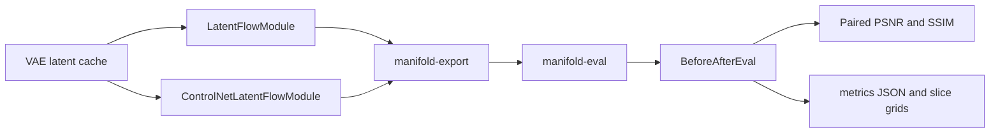

# Architecture and source map

## Component model

Manifold deliberately mirrors the diffusers vocabulary while keeping training and inference concerns separate (`CONTEXT.md`).

| Layer | Responsibility | Primary sources |
|---|---|---|
| Models | Thin wrappers around MONAI MAISI VAE/UNet/ControlNet implementations plus PatchGAN reward scoring. The VAE owns latent scaling and sliding-window encode/decode. | `src/manifold/models/` |
| Schedulers | Rectified-flow transport, timestep/sigma grids, model-input scaling, Heun integration, and stochastic GRPO/bridge transitions. They contain no training loop. | `src/manifold/schedulers/` |
| Modules | stable-pretraining training components: objectives, optimizer/schedule wiring, rollout and validation steps for JiT, the supervised ControlNet translator, reward, and GRPO. | `src/manifold/modules/` |
| Pipelines | Native inference composition of UNet, ControlNet (or frozen UNet plus ControlNet), scheduler, and VAE, with `save_pretrained`/`from_pretrained`. | `src/manifold/pipelines/` |
| Training orchestration | CLI parsing, config composition, data warming, the `CallbackRegistry` + `TrainingSpine` assembly pipeline, Lightning trainer construction, checkpointing, and export. | `src/manifold/training/`, `src/manifold/metrics/` |
| Metrics callbacks | Per-epoch FID, latent-space x0-MAE, GRPO reward, and automatic metrics line-chart rendering. | `src/manifold/metrics/`, `src/manifold/training/metrics.py` |
| Offline evaluation and reporting | `manifold-eval` policy routing, same-noise before/after generation, shared decode normalization, MONAI paired PSNR/SSIM, 2.5D slice grids, and self-contained HTML comparison. | `src/manifold/eval/`, `src/manifold/metrics/paired.py`, `src/manifold/pipelines/pipeline_utils.py` |

The shared rollout primitives are intentional: training-time sampling and native inference delegate to the same sampler behavior rather than maintaining parallel integrators. `LatentFlowModule.sample` and `LatentFlowPipeline.sample_latent` both call `sample_latent_flow` (`src/manifold/modules/sampler.py`); `ControlNetLatentFlowModule.sample`, `ControlNetLatentFlowPipeline.__call__`, the GRPO ControlNet-policy suffix, and the reward fake-builder all call `controlnet_rollout` / `controlnet_x0` (`src/manifold/modules/controlnet_sampler.py`); the GRPO anchor + suffix share `FlowMatchGRPOScheduler.rollout_range` (ADR-0005).

*Figure: Training and native artifacts converge at export, then the evaluation path scores paired targets and writes portable artifacts.*

## Runtime flows

### Noise-to-data JiT

A frozen VAE encodes volumes into an unscaled cache. The data layer estimates a single scaling factor and applies it on read. `LatentFlowModule` trains the conditional UNet to predict the clean latent from interpolated noise, while `FlowMatchHeunDiscreteScheduler` owns transport and integration. `LatentFlowPipeline` starts inference from Gaussian noise, applies optional interval-restricted classifier-free guidance, integrates from `t=0` to `t=1`, and decodes the result.

Start with:

- `src/manifold/data/latent_pipeline.py`, `latent_dataset.py`, `warm_datamodule.py`
- `src/manifold/modules/latent_flow.py`, `sampler.py`
- `src/manifold/schedulers/scheduling_flow_match_heun.py`
- `src/manifold/pipelines/latent_flow.py`
- `src/manifold/training/cli.py`

### Supervised paired translator (ControlNet)

The paired `x_src -> x_tgt` translator is a **trainable ControlNet on a frozen JiT base UNet** — see the component model above and `docs/adr/0026-controlnet-via-monai-native-residual-interface.md`, `0027-controlnet-supervised-then-grpo-two-stage.md`. The ControlNet mirrors the base UNet's encoder (`conv_in` + the input-embedding path + `down_blocks` + `middle_block`) and adds a `controlnet_cond_embedding` conv that maps the source latent `x_src` to the `conv_in` output width and **adds** it post-`conv_in` (a separate control pathway — it is *not* concatenated into `z_t`). It then emits per-block residuals that the frozen base consumes through an **out-of-place** forward (in-place adds in MONAI's `_apply_down_blocks` would break the grad-bearing residual path; ADR-0026's corrected hazard). The frozen base UNet is held **registered + dual-excluded** via [`FrozenArmMixin`](frozen-arm-and-device-policy.md#frozenarmmixin-register--dual-exclude) (ADR-0031 A1): registered so Lightning owns device placement, dual-excluded (`requires_grad=False` + `state_dict` strip + `train()` re-eval) so it is off the optimizer and off the checkpoint. The ControlNet's (src, tgt) contrast embeddings combine through `concat([embed(src), embed(tgt+offset)])` with the optional `paired_direction_offset` flipping the symmetry; the base itself sees only the target-contrast label. The supervised loss is the `(1 - t)^-2`-weighted x0-MSE the base itself was trained with (ADR-0002 / ADR-0027). Zero-init zero-convs keep the initial ControlNet residuals at zero, so a fresh supervised ControlNet reproduces the pretrained base UNet byte-identically (a safe warm-start).

The paired reward pipeline was deleted in ADR-0034 (paired-reward CLI, condition-aware `2·C` reward, offline pair precompute); the ControlNet path no longer needs a condition-aware reward because translation fidelity now comes from `x_src` conditioning + supervised init + the KL anchor, and the *single* realism reward (`RewardModel`, `C_latent`, partial-denoise pairs) scores `z_K` unconditionally for both GRPO policies.

BraTS-specific code groups volumes by subject and contrast, creates subject-disjoint splits, and enumerates all ordered non-self pairs. The dataset contract itself remains generic: source/target latents, labels, and spacing. The shared two-way subject splitter `_train_val_manifests` lives in `src/manifold/data/paired_manifests.py` (relocated from the deleted paired-reward CLI, consumed by `controlnet_cli` and `grpo_cli`).

<!-- openwiki: broken internal link [evaluation.md#accepted-in-training-monitor-planned-not-active] heading anchor "accepted-in-training-monitor-planned-not-active" does not exist in "evaluation.md". Fix the href or restore the target, then delete this comment. -->
The active supervised checkpoint monitor remains latent-space `val/x0_mae`. ADR-0037 accepts an observe-only fixed-subset `val/psnr` / `val/ssim` callback, but that callback is not implemented in the current tree; treat the decision and its extension surface as planned work described in [Before/after GRPO evaluation](evaluation.md#accepted-in-training-monitor-planned-not-active).

Start with:

- `src/manifold/data/paired_brats.py`, `paired_volume_dataset.py`, `paired_latent_dataset.py`, `paired_manifests.py`
- `src/manifold/models/controlnet_3d.py`
- `src/manifold/modules/controlnet_latent_flow.py`, `controlnet_sampler.py`
- `src/manifold/pipelines/controlnet_latent_flow.py`
- `src/manifold/training/controlnet_cli.py`
- `configs/train/config_controlnet_supervised.yaml`

### Reward and policy post-training

`RewardModel` wraps a MONAI PatchGAN discriminator and pools its output to a scalar. Reward training learns a mode-agnostic realism score from partial-denoise corruption pairs. The unified `GRPOModule` can optimize either the JiT UNet policy or a warm-started ControlNet on a frozen base UNet; both paths fork stochastic transitions and score the terminal latent `z_K` unconditionally with the *same* reward before applying the clipped group-relative objective. The policy is inferred from the native artifact passed to `--native-dir`, not a flag. For the ControlNet path, translation fidelity comes from `x_src` conditioning, supervised initialization, and the KL anchor rather than a separate condition-aware reward (ADR-0034 deleted the paired-reward pipeline). See the operational routing and recipe contract in [Reward and GRPO stages](workflows.md#reward-and-grpo-stages).

Start with `src/manifold/models/reward_model.py`, `src/manifold/modules/{reward,grpo}.py`, `src/manifold/modules/controlnet_sampler.py`, and `src/manifold/training/{reward_cli,grpo_cli,controlnet_cli}.py`.

### Before/after GRPO evaluation

The shipped `manifold-eval` command exports the post-GRPO checkpoint against the before export's component structure, reloads both artifacts, and sends them through `BeforeAfterEval`. The driver creates identical initial noise and conditioning for each seed, decodes every latent with the frozen VAE, and applies the shared `min_max_to_unit` contract. JiT emits a `before | after` provenance-only metric record; ControlNet additionally scores each generated target against its real target with MONAI 3D PSNR/SSIM. One 2.5D three-plane grid is written per sample. See [Before/after GRPO evaluation](evaluation.md#runtime-flow) for the runtime sequence, public API, artifact schema, and the accepted-but-unimplemented in-training monitor.

Start with `src/manifold/eval/cli.py`, `src/manifold/eval/before_after.py`, `src/manifold/eval/comparison_page.py`, `src/manifold/metrics/paired.py`, and `src/manifold/pipelines/pipeline_utils.py`.

## Configuration and persistence

Manifold has two config systems by design (ADR-0004). The **experiment config** is OmegaConf: env (paths) → train/inference recipe → network-construction kwargs, composed by `src/manifold/config/loader.py` and built into components by `builder.py`. Each later top-level YAML block replaces earlier ones wholesale (not deep-merged), `_base_` provides inheritance *inside* a single file, required paths are `???` (OmegaConf MISSING — fail-fast on read, with `require_paths` surfacing the unset key), and CLI `--<key>` flags plus Hydra-style dotlist overrides layer on top (dotlist wins). The composed config builds components at launch and never persists them.

The **component config** is the JSON `config.json` each component writes via `register_to_config` / `ConfigMixin` (`src/manifold/configuration.py`) and round-trips through `from_pretrained` / `save_pretrained` — the diffusers-style persistence contract for a trained component, independent of how it was launched. Manifold's mixin is its own minimal implementation (it does **not** subclass `diffusers.ConfigMixin`; ADR-0001).

Native inference directories contain per-component subdirectories (`unet/`, `vae/`, `scheduler/`, plus `controlnet/` for the ControlNet pipeline), each carrying its `config.json` (and `diffusion_pytorch_model.pt` for models). The directory's top-level `model_index.json` self-describes the pipeline (`pipeline_class` + component qualnames). Lightning `.ckpt` files are training state and are not loaded directly by pipelines; export is the bridge (`src/manifold/training/export.py` → `manifold-export`, ADR-0006, now the sole checkpoint → inference path after ADR-0007 retired the hope→native converter). The export bakes the **raw** optimizer weights as the inference UNet (EMA training was removed; the `val/fid` monitor and the export are deliberately aligned so the exported "best" is best for the weights that are published). The ControlNet export reuses the same one-shot bridge with `pipeline_cls=ControlNetLatentFlowPipeline`; only the `controlnet.*` keys are baked from the supervised checkpoint (the frozen base is held unregistered and passed through from `--base-native-dir`).

`manifold-eval` depends on this boundary: its before directory supplies the loadable policy template and self-described `pipeline_class`, while the export bridge bakes the after `.ckpt` into `<output>/after_native`. The eval CLI therefore infers JiT versus ControlNet from the artifact's `pipeline_class` rather than accepting a policy flag (ADR-0034). See [Checkpoint and export contract](workflows.md#checkpoint-and-export-contract) and the eval [policy dispatch contract](evaluation.md#policy-dispatch-and-artifact-contract).

## Change guidance

- **Transport/integration:** change the scheduler and shared sampler path together; run scheduler, pipeline, and module tests to prevent train/inference drift.
- **Latent scaling:** preserve VAE ownership and the unscaled-cache contract; check VAE, data, persistence, and pipeline tests.
- **Paired conditioning/pairing:** keep BraTS discovery outside the generic dataset contract and preserve subject-level split isolation.
- **Paired fidelity/evaluation:** preserve the `min_max_to_unit` → `PairedFidelityMetrics(data_range=1.0)` ordering and same-noise before/after contract across the pipeline, offline eval, and the future in-training monitor. A normalization, artifact, or report-schema change is a cross-component change, not a local patch.
- **Metrics:** distinguish per-rank accumulation from global reduction. Manual all-reduced metrics must not also use `sync_dist`, or they will be reduced twice.
- **Checkpoint behavior:** update training callbacks, export, downstream frozen-generator loaders, and tests as one contract.
- **Frozen arms:** new frozen-arm wiring MUST go through `FrozenArmMixin._register_frozen_arm`, not via `object.__setattr__` or any custom state-dict override — the mixin is the single owner of the register + dual-exclude contract (ADR-0031 A1). The frozen arms stay in `parameters()` (Lightning owns device placement) but carry no grad and emit no checkpoint key.
- **Per-rank device:** shells MUST resolve the per-rank CUDA device through `DevicePolicy.pin()` (pre-PG) and `DevicePolicy.warm_device(fallback)` (post-PG VAE warm); do not reintroduce the inline `set_device` twin, the bare `torch.device("cuda" if torch.cuda.is_available() else "cpu")` in the controlnet path, or `manifold.data.latent_pipeline.resolve_warm_device` (ADR-0035).
- **Callbacks:** new callbacks MUST go through the `CallbackRegistry` two-phase resolve/build; the `TrainingSpine.run` merge order is the single source of truth for which callbacks fire, which knobs apply, and which monitors are allowed (ADR-0029 / ADR-0032).

For component-level change navigation (entry points, focused tests, minimal validation), see the [Quickstart task routing](quickstart.md#task-routing) and the stage-level table in [Workflows change navigation](workflows.md#change-navigation).
