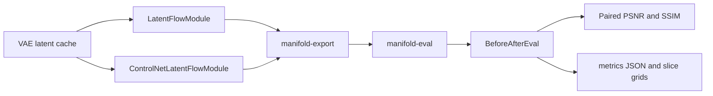
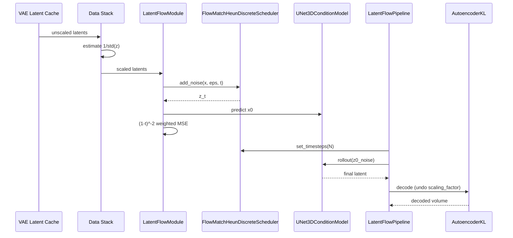
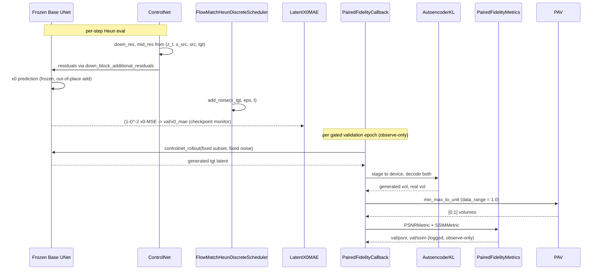
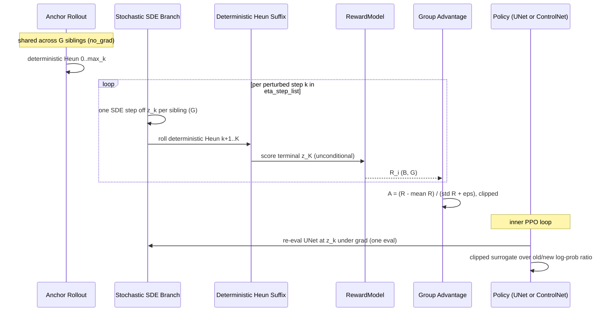

# Architecture and source map

Manifold deliberately mirrors the diffusers vocabulary while keeping training
and inference concerns separate (`CONTEXT.md`, ADR-0001). The codebase does
**not** subclass `diffusers.{ModelMixin,SchedulerMixin,DiffusionPipeline}` —
it mimics the layout and naming with manifold-defined lightweight base classes;
`diffusers` stays a utility-only dependency. Backbones stay on MONAI MAISI
(wrapped, never reimplemented).

## Component model

| Layer | Responsibility | Primary sources |
|---|---|---|
| Models | Thin wrappers around MONAI MAISI VAE/UNet/ControlNet implementations plus PatchGAN reward scoring. The VAE owns `scale_factor` (`encode` returns scaled latents, `decode` undoes it) and sliding-window encode/decode. | `src/manifold/models/` |
| Schedulers | Rectified-flow transport (`z = t·x + (1−t)·e`), timestep/sigma grids, model-input scaling, two-evaluation Heun integration, partial-denoise grids, and the equimarginal reverse-SDE transition that powers GRPO. They contain no training loop and own no real data. | `src/manifold/schedulers/` |
| Modules | `stable_pretraining` training components: logit-normal timestep sampling, the `(1−t)⁻²` loss weight, optimizer/schedule wiring, rollout + validation steps for JiT, the supervised ControlNet translator, reward, and GRPO. The shared `FrozenArmMixin` (ADR-0031 A1) is the canonical owner of the register + dual-exclude frozen-arm contract. | `src/manifold/modules/` |
| Pipelines | Native inference composition of UNet, ControlNet (or frozen UNet plus ControlNet), scheduler, and VAE, with `save_pretrained` / `from_pretrained` writing and reading the per-component directory layout (ADR-0003 / ADR-0006). The published-volume normalization (`min_max_to_unit`, `data_range = 1.0`) lives here. | `src/manifold/pipelines/` |
| Training orchestration | CLI parsing, config composition, the `CallbackRegistry` + `TrainingSpine` assembly pipeline (ADR-0029 / ADR-0032), the `DevicePolicy` per-rank device decision (ADR-0035), Lightning trainer construction, checkpointing, and the ADR-0006 export bridge. | `src/manifold/training/`, `src/manifold/config/` |
| Metrics callbacks | Per-epoch unbiased 2.5D FID, latent-space x0-MAE, the observe-only in-training `val/psnr`/`val/ssim` paired-fidelity monitor, GRPO reward metrics, and automatic line-chart rendering. | `src/manifold/metrics/`, `src/manifold/training/metrics.py` |
| Offline evaluation and reporting | `manifold-eval` policy routing, same-noise before/after generation, shared decode + `min_max_to_unit`, MONAI 3D PSNR/SSIM, 2.5D slice grids, and the shareable comparison page builder. | `src/manifold/eval/`, `src/manifold/metrics/paired.py`, `src/manifold/pipelines/pipeline_utils.py` |

The shared rollout primitives are intentional: training-time sampling and
native inference delegate to the same sampler rather than maintaining parallel
integrators (ADR-0005; `src/manifold/modules/sampler.py`,
`controlnet_sampler.py`).


```mermaid
flowchart LR
    Cache["VAE latent cache"] --> JiT["LatentFlowModule"]
    Cache --> ControlNet["ControlNetLatentFlowModule"]
    JiT --> Export["manifold-export"]
    ControlNet --> Export
    Export --> Eval["manifold-eval"]
    Eval --> Core["BeforeAfterEval"]
    Core --> Metric["Paired PSNR and SSIM"]
    Core --> Artifacts["metrics JSON and slice grids"]
```

*Figure: Training and native artifacts converge at export, then the evaluation
path scores paired targets and writes portable artifacts.*

## Callback and device seams

Two cross-cutting mechanisms appear in every CLI's assembly code; the architecture
pages linked here document each in detail.

- **`CallbackRegistry` + `TrainingSpine`** (ADR-0029 / ADR-0032) — the typed
  name → spec dispatcher and the single caller that composes the five training
  CLIs. See [Callback registry and training spine](callback-registry.md) for the
  spec contract, the two-phase resolve/build construction, the post-resolve
  monitor validation, and the post-merge `forbidden_callbacks` /
  `forbidden_monitors` guards.
- **`FrozenArmMixin` + `DevicePolicy`** (ADR-0031 A1 / ADR-0035) — the canonical
  register-and-dual-exclude frozen-arm mechanism (off the optimizer + off the
  checkpoint, on the module tree so Lightning owns device placement) and the
  per-rank CUDA device decision. See [Frozen arms and per-rank device policy](frozen-arm-and-device-policy.md) for the mixin contract, the
  pre-PG `pin()` / post-PG `warm_device(fallback)` split, and the source-guard
  tests.

## Runtime flows

### Noise-to-data JiT

A frozen VAE encodes volumes into an unscaled cache. The data layer estimates a
single `scale_factor` (over the unscaled cache, ADR-0003) and applies it on
read. `LatentFlowModule` trains the conditional UNet to predict the clean
latent from interpolated noise, while `FlowMatchHeunDiscreteScheduler` owns
transport and integration (ADR-0001: the module calls
`scheduler.add_noise` rather than re-deriving the noising). The supervised
loss is the `(1−t)⁻²`-weighted x0-MSE (ADR-0002).

`LatentFlowPipeline` starts inference from Gaussian noise, applies optional
interval-restricted classifier-free guidance, integrates from `t=0` to `t=1`,
and decodes the result. Both `LatentFlowModule.sample()` and
`LatentFlowPipeline.sample_latent()` delegate to the same
`sample_latent_flow` primitive (`src/manifold/modules/sampler.py`), so training
and inference share one rollout (`src/manifold/modules/sampler.py`).


```mermaid
sequenceDiagram
    participant Cache as VAE Latent Cache
    participant Data as Data Stack
    participant Module as LatentFlowModule
    participant Sched as FlowMatchHeunDiscreteScheduler
    participant Unet as UNet3DConditionModel
    participant Pipeline as LatentFlowPipeline
    participant VAE as AutoencoderKL

    Cache->>Data: unscaled latents
    Data->>Data: estimate 1/std(z)
    Data->>Module: scaled latents
    Module->>Sched: add_noise(x, eps, t)
    Sched-->>Module: z_t
    Module->>Unet: predict x0
    Module->>Module: (1-t)^-2 weighted MSE
    Pipeline->>Sched: set_timesteps(N)
    Pipeline->>Unet: rollout(z0_noise)
    Unet-->>Pipeline: final latent
    Pipeline->>VAE: decode (undo scaling_factor)
    VAE-->>Pipeline: decoded volume
```

*Figure: JiT noise-to-data flow — the same scheduler transport feeds training
(`add_noise`) and inference (`set_timesteps` + Heun rollout), and inference
shares the rollout primitive with training (ADR-0005).*

Start with:

- `src/manifold/data/latent_pipeline.py`, `latent_dataset.py`, `warm_datamodule.py`
- `src/manifold/modules/latent_flow.py`, `sampler.py`
- `src/manifold/schedulers/scheduling_flow_match_heun.py`
- `src/manifold/pipelines/latent_flow.py`
- `src/manifold/training/cli.py`

### Supervised paired translator (ControlNet)

The paired `x_src → x_tgt` translator is a **trainable ControlNet on a frozen
JiT base UNet** — see the component model above and
[ADR-0026](../docs/adr/0026-controlnet-via-monai-native-residual-interface.md),
[ADR-0027](../docs/adr/0027-controlnet-supervised-then-grpo-two-stage.md). The
ControlNet consumes `(z_t, x_src, src_label, tgt_label)` and emits per-block
residuals that the frozen base consumes through an **out-of-place** forward
(in-place adds break the grad-bearing residual path — the
MONAI `DiffusionModelUNetMaisi`'s in-place `+=` bumps the residual tensor's
autograd version, see ADR-0026's hazard correction). The frozen base UNet is
held **registered + dual-excluded** via
[`FrozenArmMixin`](frozen-arm-and-device-policy.md#frozenarmmixin-register--dual-exclude)
(ADR-0031 A1): registered so Lightning owns device placement, dual-excluded
(`requires_grad=False` + `state_dict` strip + `train()` re-eval) so it is off
the optimizer and off the checkpoint. The ControlNet's (src, tgt) direction
embeddings combine through a direction MLP on the ControlNet's class-embedding
path; the optional `paired_direction_offset` shifts the tgt label indexing so
the 12 ordered BraTS pairs share one embedding table. The supervised loss is
the `(1−t)⁻²`-weighted x0-MSE the base itself was trained with (ADR-0002 /
ADR-0027).

The supervised ControlNet translator is monitored by **two** validators:

- **`val/x0_mae`** — the active checkpoint monitor. Logged by the
  non-registry `LatentX0MAE` callback appended by `controlnet_cli`; selects the
  best `.ckpt` (`mode="min"`).
- **`val/psnr` / `val/ssim`** — the **observe-only in-training paired-fidelity
  monitor** (ADR-0037), registered as the `paired_fidelity` spec on the
  `CallbackRegistry` and attached to the supervised controlnet's default
  callback-name set
  (`default_names=["train_loss", "checkpoint", "paired_fidelity"]`,
  `src/manifold/training/controlnet_cli.py`). On each gated validation
  epoch the `PairedFidelityCallback` rolls a small fixed paired subset under
  fixed initial noise through the module's own full Heun
  `controlnet_rollout`, decodes via `VaeStage` + `LatentDecoder`, normalizes
  to `[0, 1]` with `min_max_to_unit`, and scores 3D PSNR + 3D SSIM with
  `PairedFidelityMetrics` (`src/manifold/metrics/paired.py`,
  `paired_callback.py`). The metrics are logged for trend-watching only —
  never a checkpoint monitor, never a loss term. The rollout step count
  defaults to the inference-recipe knob (`controlnet.num_inference_steps`,
  15) but the spec's own `num_inference_steps` is an optional override
  layered on top.

The paired reward pipeline was deleted in ADR-0034 (paired-reward CLI,
condition-aware `2·C` reward, offline pair precompute); the ControlNet path
no longer needs a condition-aware reward because translation fidelity now
comes from `x_src` conditioning + supervised init + the KL anchor, and the
*single* realism reward (`RewardModel`, `C_latent`, partial-denoise pairs)
scores `z_K` unconditionally for both GRPO policies.

BraTS-specific code groups volumes by subject and contrast, creates
subject-disjoint splits, and enumerates all ordered non-self pairs. The
dataset contract itself remains generic: source/target latents, labels, and
spacing. The shared two-way subject splitter `_train_val_manifests` lives in
`src/manifold/data/paired_manifests.py` (relocated from the deleted
paired-reward CLI, consumed by `controlnet_cli` and `grpo_cli`).


```mermaid
sequenceDiagram
    participant Base as Frozen Base UNet
    participant CN as ControlNet
    participant Sched as FlowMatchHeunDiscreteScheduler
    participant X0MAE as LatentX0MAE
    participant PF as PairedFidelityCallback
    participant VAE as AutoencoderKL
    participant Fid as PairedFidelityMetrics

    Note over Base,CN: per-step Heun eval
    CN->>CN: down_res, mid_res from (z_t, x_src, src, tgt)
    CN->>Base: residuals via down_block_additional_residuals
    Base->>Base: x0 prediction (frozen, out-of-place add)
    Sched->>Sched: add_noise(x_tgt, eps, t)
    Base-->>X0MAE: (1-t)^-2 x0-MSE -> val/x0_mae (checkpoint monitor)

    Note over PF: per gated validation epoch (observe-only)
    PF->>Base: controlnet_rollout(fixed subset, fixed noise)
    Base-->>PF: generated tgt latent
    PF->>VAE: stage to device, decode both
    VAE-->>PF: generated vol, real vol
    PF->>PAV: min_max_to_unit (data_range = 1.0)
    PAV-->>PF: [0,1] volumes
    PF->>Fid: PSNRMetric + SSIMMetric
    Fid-->>PF: val/psnr, val/ssim (logged, observe-only)
```

*Figure: Supervised ControlNet — both `val/x0_mae` (the checkpoint monitor)
and the observe-only `val/psnr` / `val/ssim` paired-fidelity monitor log
on each gated epoch, sharing the same rollout primitive (`controlnet_rollout`,
ADR-0005).*

Start with:

- `src/manifold/data/paired_brats.py`, `paired_volume_dataset.py`,
  `paired_latent_dataset.py`, `paired_manifests.py`
- `src/manifold/models/controlnet_3d.py`
- `src/manifold/modules/controlnet_latent_flow.py`, `controlnet_sampler.py`
- `src/manifold/pipelines/controlnet_latent_flow.py`
- `src/manifold/training/controlnet_cli.py`
- `src/manifold/training/callbacks/paired_fidelity.py`,
  `src/manifold/metrics/paired.py`,
  `src/manifold/metrics/paired_callback.py`
- `configs/train/config_controlnet_supervised.yaml`

### Reward and policy post-training

`RewardModel` wraps a MONAI PatchGAN discriminator and pools its output to a
scalar. Reward training learns a mode-agnostic realism score from
partial-denoise corruption pairs (ADR-0010's online rollout with the frozen
JiT x0-denoiser held inside the `RewardModule` via `FrozenArmMixin`). The
unified `GRPOModule` can optimize either the JiT UNet policy or a warm-started
ControlNet on a frozen base UNet; both paths fork stochastic SDE transitions
(`sde_step_mean` on `FlowMatchGRPOScheduler`, which inherits transport + Heun
from `FlowMatchHeunDiscreteScheduler`) and score the terminal latent `z_K`
unconditionally with the *same* reward before applying the clipped
group-relative objective. The policy is inferred from the native artifact
passed to `--native-dir`, not a flag (a `controlnet` component in
`model_index.json` switches the policy). For the ControlNet path, translation
fidelity comes from `x_src` conditioning, supervised initialization, and the
KL anchor rather than a separate condition-aware reward (ADR-0034 deleted the
paired-reward pipeline). The ControlNet policy's FID is suppressed two ways:
at default-derivation (a constant frozen-base metric) and post-merge via the
spine's `forbidden_callbacks` / `forbidden_monitors` guards — a YAML or
`--callbacks fid` override cannot re-enable it.


```mermaid
sequenceDiagram
    participant Anchor as Anchor Rollout
    participant Branch as Stochastic SDE Branch
    participant Suffix as Deterministic Heun Suffix
    participant Reward as RewardModel
    participant Adv as Group Advantage
    participant Policy as Policy (UNet or ControlNet)

    Note over Anchor: shared across G siblings (no_grad)
    Anchor->>Anchor: deterministic Heun 0..max_k

    loop per perturbed step k in eta_step_list
        Branch->>Branch: one SDE step off z_k per sibling (G)
        Branch->>Suffix: roll deterministic Heun k+1..K
        Suffix->>Reward: score terminal z_K (unconditional)
        Reward-->>Adv: R_i (B, G)
    end

    Adv->>Adv: A = (R - mean R) / (std R + eps), clipped
    Note over Policy: inner PPO loop
    Policy->>Branch: re-eval UNet at z_k under grad (one eval)
    Policy->>Policy: clipped surrogate over old/new log-prob ratio
```

*Figure: GRPO singular-branch rollout (ADR-0011) — one deterministic anchor
trajectory, one stochastic SDE branch per perturbed step, deterministic Heun
suffix to the terminal `z_K` that the shared unconditional reward scores;
the inner PPO loop re-evaluates the UNet at the stored `z_k` under grad.
Either policy (UNet or ControlNet on a frozen base) routes through the same
spine; the policy is inferred from the native artifact, not a flag.*

Start with `src/manifold/models/reward_model.py`,
`src/manifold/modules/{reward,grpo,partial_denoise}.py`,
`src/manifold/modules/controlnet_sampler.py`, and
`src/manifold/training/{reward_cli,grpo_cli,controlnet_cli}.py`.

### Before/after GRPO evaluation

The shipped `manifold-eval` command exports the post-GRPO checkpoint against
the before export's component structure, reloads both artifacts, and sends
them through `BeforeAfterEval`. The driver creates identical initial noise
and conditioning for each seed, decodes every latent with the frozen VAE,
and applies the shared `min_max_to_unit` contract. JiT emits a `before |
after` provenance-only metric record; ControlNet additionally scores each
generated target against its real target with MONAI 3D PSNR/SSIM (the
*offline* counterpart of the in-training `PairedFidelityCallback`). One
2.5D three-plane slice grid is written per sample. The policy is inferred
from the before artifact's `model_index.json` `pipeline_class`, not a flag
(ADR-0034 artifact-inference convention).

<!-- openwiki: mermaid parse failed and this diagram was converted to a text fence so it does not break rendering. Fix the diagram source and restore the mermaid fence. Parser error: Heuristic: a semicolon inside a label breaks rendering; rephrase the label. -->
```text
sequenceDiagram
    participant Before as Before Native Dir
    participant Eval as manifold-eval
    participant AfterCkpt as After Lightning ckpt
    participant Export as export_to_native
    participant Driver as BeforeAfterEval
    participant VAE as AutoencoderKL
    participant Grid as SliceGrid
    participant Metrics as metrics.json

    Before->>Eval: read model_index.json pipeline_class
    Eval->>Before: probe pipeline = from_pretrained(before_dir)
    Eval->>AfterCkpt: torch.load
    Eval->>Export: export_to_native(unet=probe.unet, vae=probe.vae, scheduler=probe.scheduler)
    Export-->>Eval: <output>/after_native
    Eval->>Before: before_pipe = from_pretrained (fresh)
    Eval->>Eval: after_pipe = from_pretrained(after_dir)

    alt JiT (unconditional)
        Driver->>Driver: identical seed -> generator(seed) per side
        Driver->>Driver: sample_latent on both
    else ControlNet (paired)
        Driver->>Driver: shared noise tensor for both
        Driver->>Driver: sample_latent(noise, x_src, src_label, tgt_label)
        Driver->>VAE: decode before / after / real
        Driver->>Driver: PairedFidelityMetrics(before, real), (after, real)
    end

    Driver->>VAE: decode to volumes
    Driver->>Driver: min_max_to_unit -> [0, 1]
    Driver->>Grid: slice_grid (per sample, before|after[|real])
    Grid-->>Driver: PNG paths
    Driver->>Metrics: write JSON (psnr/ssim for paired; provenance for jit)
```

*Figure: `manifold-eval` before/after flow — one seed produces identical
noise for both sides; JiT emits a before/after grid only; ControlNet adds a
real-target column and 3D PSNR/SSIM scores. The policy is inferred from
`model_index.json` so no `--policy` flag is needed.*

See [Before/after GRPO evaluation](evaluation.md#runtime-flow) for the public
API, the artifact schema, and the comparison-page builder.

Start with `src/manifold/eval/cli.py`, `src/manifold/eval/before_after.py`,
`src/manifold/eval/comparison_page.py`, `src/manifold/metrics/paired.py`,
and `src/manifold/pipelines/pipeline_utils.py`.

## Configuration and persistence

Experiment YAML is composed by `src/manifold/config/loader.py` and built into
components by `src/manifold/config/builder.py`. Later top-level blocks replace
earlier ones unless `_base_` explicitly requests inheritance (ADR-0004). This
launch-time OmegaConf layer is **separate** from the persisted component JSON
handled by `src/manifold/configuration.py` (`ConfigMixin` /
`register_to_config` round-trips), which is the diffusers-style persistence
contract for a trained component, independent of how it was launched.

Native inference directories contain component configuration/weights
(including `model_index.json` and component subdirectories). Lightning `.ckpt`
files are training state and are not loaded directly by pipelines; export is
the bridge (ADR-0006). `manifold-eval` depends on this boundary: its before
directory supplies the loadable policy template and self-described
`pipeline_class`, while the existing export bridge bakes the after `.ckpt`
into `<output>/after_native`. The eval CLI therefore infers JiT versus
ControlNet from the artifact rather than accepting a policy flag. See
[Checkpoint and export contract](workflows.md#checkpoint-and-export-contract)
and the eval [policy dispatch contract](evaluation.md#policy-dispatch-and-artifact-contract).

### `--pipeline paired` is stale code (not retired at the file-system layer)

`manifold-export`'s `--pipeline` flag still exposes a `paired` choice (the
src→tgt `PairedLatentFlowPipeline`, the paired-reward generator) in
`src/manifold/training/export_cli.py`. ADR-0034 retired that pipeline from the
training stack (the paired-reward CLI is gone, the paired-GRPO Brownian bridge
is gone, and the supervised ControlNet is the replacement paired MRI path),
but the export flag's `paired` branch is still wired. New code must **not**
rely on it; treat it as a stale code reference rather than a supported
pipeline. `jit` and `controlnet` remain the supported `--pipeline` choices.

## Change guidance

- **Transport/integration:** change the scheduler and the shared sampler path
  together; run scheduler, pipeline, and module tests to prevent train /
  inference drift (ADR-0001 / ADR-0002 / ADR-0005).
- **Latent scaling:** preserve VAE ownership and the unscaled-cache contract;
  check VAE, data, persistence, and pipeline tests (ADR-0003).
- **Paired conditioning / pairing:** keep BraTS discovery outside the generic
  dataset contract and preserve subject-level split isolation
  (`_train_val_manifests` in `src/manifold/data/paired_manifests.py`).
- **Paired fidelity / evaluation:** preserve the `min_max_to_unit` →
  `PairedFidelityMetrics(data_range=1.0)` ordering and the same-noise
  before/after contract across the pipeline, the offline `BeforeAfterEval`,
  and the in-training `PairedFidelityCallback`. A normalization, artifact, or
  report-schema change is a cross-component change, not a local patch
  (ADR-0036 / ADR-0037).
- **Metrics:** distinguish per-rank accumulation from global reduction. Manual
  all-reduced metrics must not also use `sync_dist`, or they will be reduced
  twice (ADR-0025 / ADR-0030).
- **Checkpoint behavior:** update training callbacks, export, downstream
  frozen-generator loaders, and tests as one contract (ADR-0006 / ADR-0029).
- **Frozen arms:** new frozen-arm wiring MUST go through
  `FrozenArmMixin._register_frozen_arm`, not via `object.__setattr__` or any
  custom state-dict override — the mixin is the single owner of the register +
  dual-exclude contract (ADR-0031 A1). The frozen arms stay in `parameters()`
  (Lightning owns device placement) but carry no grad and emit no checkpoint
  key.
- **Per-rank device:** shells MUST resolve the per-rank CUDA device through
  `DevicePolicy.pin()` (pre-PG) and `DevicePolicy.warm_device(fallback)`
  (post-PG VAE warm); do not reintroduce the inline `set_device` twin, the
  bare `torch.device("cuda" if torch.cuda.is_available() else "cpu")` in the
  controlnet path, or
  `manifold.data.latent_pipeline.resolve_warm_device` (ADR-0035).
- **Callbacks:** new callbacks MUST go through the `CallbackRegistry` two-phase
  resolve / build; the `TrainingSpine.run` merge order is the single source of
  truth for which callbacks fire, which knobs apply, and which monitors are
  allowed (ADR-0029 / ADR-0032). See
  [Callback registry and training spine](callback-registry.md) for the spec
  contract, two-phase construction, and post-merge `forbidden_callbacks` /
  `forbidden_monitors` guards.
- **Pipeline export flag:** `--pipeline paired` is stale (ADR-0034). Do not
  rely on it; use `--pipeline jit` or `--pipeline controlnet`.

For component-level change navigation (entry points, focused tests, minimal
validation), see [Quickstart task routing](quickstart.md#task-routing) and the
stage-level table in [Workflows change navigation](workflows.md#change-navigation).
