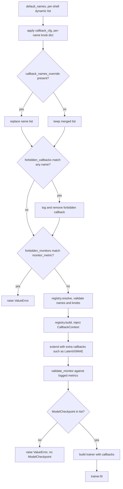

# Callback registry and training spine

`CallbackRegistry` (ADR-0029) is the typed name → spec dispatcher that replaced
the ad-hoc `_build_callbacks` / `_build_checkpoint` clones that used to live in
every training CLI. `TrainingSpine` (ADR-0032) is the **single caller** of that
registry: it owns the `assemble → resolve → build → validate → trainer → fit`
sequence, plus the post-merge `forbidden_callbacks` / `forbidden_monitors` guards
that let a shell drop a callback no YAML or `--callbacks` override can re-enable.
Every training CLI now ends with `spine.run(...)`; the CLI's only responsibility
left is seeding, building the module + datamodule, and computing its dynamic
default callback-name set.

This page documents the spec contract, the two-phase construction, the
post-resolve monitor validation, and the spine's merge order — the load-bearing
pieces of any callback addition, knob rename, or "drop FID on the GRPO ControlNet
path" change.

## Spec contract

Every callback registered with the registry is a `@dataclass` class with two
things (`src/manifold/training/callbacks/registry.py`):

1. **Knobs as dataclass fields** (with defaults). The field set is the
   allow-list used by `CallbackRegistry.resolve` to reject unknown knobs with a
   loud `ValueError` before any `pl.Callback` is built.
2. **A `build(self, ctx: CallbackContext) -> pl.Callback` method** that takes
   the runtime-objects bag and returns a constructed Lightning callback.

Specs match the `CallbackSpec` Protocol structurally — no inheritance
(`manifold.training.callbacks.registry.CallbackSpec`). A spec may optionally
expose:

- `logged_metrics: frozenset[str]` — the metrics the built callback logs. Used
  by `validate_monitor` so a `CheckpointSpec.monitor_metric` resolves against the
  full set of metric emitters, not just the registry ones.
- `monitor_metric: str | None` — the special-case field `validate_monitor`
  scans for. Only `CheckpointSpec` declares it.

## Two-phase construction

ADR-0029 splits spec instantiation from callback construction because generative
callbacks need runtime objects that do not exist at config resolution. FID injects
the VAE, feature network, and sampling recipe; the supervised ControlNet
`PairedFidelitySpec` injects the module, VAE, and datamodule plus the recipe-primary
rollout step count.

- **`CallbackRegistry.resolve(names, cfg)` (config-time)** — validates the
  requested name list and the per-name knob dict, then returns constructed spec
  instances in `names` order. Unknown name → `KeyError` with the registered
  set; unknown knob for a known name → `ValueError` with the allowed set.
  The list is **rank-symmetric** by contract (every DDP rank gets the same CLI
  args from `torchrun`).
- **`CallbackRegistry.build(specs, ctx)` (fit-prep)** — injects the runtime
  `CallbackContext` (the module, VAE, datamodule, inference recipe, model dir,
  seed, optional lazy `feature_net_factory`, optional `real_latents`) and
  returns the constructed `pl.Callback` list.

A callback that needs neither a knob nor a runtime object (e.g. `TrainLossSpec`)
is fine with empty fields and an empty `ctx`; the registry does not enforce a
minimum surface.

## Post-resolve monitor validation

`CallbackRegistry.validate_monitor(specs, module, extra_callbacks=None)` runs
**after** resolve/build, **before** the trainer is built. The contract:

- If no checkpoint spec is present, or its `monitor_metric` is `None`
  (the unmonitored periodic / last path), validation is a no-op — absence is the
  intended fallback when no held-out validation is wired.
- Otherwise the `monitor_metric` must be present in the union of:
  - every spec's `logged_metrics` (the registry path),
  - the `module.logged_metrics` attribute (the Module-declared path: GRPO's
    `val/mean_reward`, the reward module's `val/gen_pair_acc`),
  - every `extra_callbacks` member's `logged_metrics` (the hand-appended path:
    `LatentX0MAE`'s `val/x0_mae`, see `src/manifold/training/metrics.py`).

A `monitor_metric` that is logged by nobody raises `ValueError` with the
available set — so Lightning does not error mid-fit on a never-logged monitor.

This validation is the safety net behind the GRPO ControlNet fid guard (see
below) and behind the `tests/test_callback_registry.py` monitor tests.

## Built-in specs

| Spec | Knobs (defaults) | Built callback | `logged_metrics` |
|---|---|---|---|
| `TrainLossSpec` | (none) | `pl.Callback` logging `train/loss_epoch` | `frozenset({"train/loss_epoch"})` |
| `FIDSpec` | `num_synth`, `cache_dir`, `device`, `feature_net_factory` (mostly defaults) | `FIDCallback` (rank-strided, lazy feature-net) | `frozenset({"val/fid"})` |
| `PairedFidelitySpec` | `subset_size=8`, `every_n_epochs=1`, `num_inference_steps=None`, `seed=0` | `PairedFidelityCallback` (fixed-subset, observe-only ControlNet monitor) | `frozenset({"val/psnr", "val/ssim"})` |
| `CheckpointSpec` | `monitor_metric`, `save_top_k`, `save_last`, `every_n_epochs`, `mode`, `filename` | `pl.callbacks.ModelCheckpoint` (monitored vs unmonitored two branches) | n/a (`validate_monitor` reads `monitor_metric` defensively) |

`CheckpointSpec.build` reproduces the prior `_build_checkpoint` two-branch
construction: `monitor_metric=None` keeps `save_top_k=1` plus `last.ckpt` at
the `every_n_epochs` cadence (the JiT production fallback); the monitored branch
tracks `monitor_metric` top-`k` plus last. The `filename` default picks
`unet3d-{epoch:03d}-{step}-{monitor:.3f}` for the monitored path and
`unet3d-{epoch:03d}-{step}` for the unmonitored path
(`src/manifold/training/callbacks/checkpoint.py`).

### Paired-fidelity shipped surface

`PairedFidelityCallback` is public from `manifold.metrics`, while
`PairedFidelitySpec` is public from `manifold.training.callbacks`; there is no
second generated or publish mirror. The shipped path is
`src/manifold/training/controlnet_cli.py`: it registers the spec, appends
`"paired_fidelity"` after `"train_loss"` and `"checkpoint"` in the default
name list, and builds `CallbackContext` with the module, VAE, datamodule, model
directory, seed, and `{"num_inference_steps": controlnet.num_inference_steps}`.
`main()` therefore enables the monitor unless `--callbacks` or a YAML callback
name list replaces the defaults.

The spec's `subset_size`, `every_n_epochs`, and `seed` knobs, plus an optional
`num_inference_steps` override, are resolved through the registry. Programmatic
callers of `run_controlnet_training(..., callback_cfg=...)` can pass a
`paired_fidelity` mapping directly. In the current shipped `main()`,
`controlnet.num_inference_steps` is read into the context and therefore takes
effect, but the other monitor keys are not copied from the composed recipe;
track that wiring gap in the [Quickstart backlog](quickstart.md#backlog) unless
CLI support is intended. The default checkpoint still monitors
`val/x0_mae`; `validate_monitor` merely accepts `val/psnr` and `val/ssim` as
explicit opt-in monitors.

## TrainingSpine.run — the merge order

`TrainingSpine.run` is a single method, parameterized by named arguments rather
than a per-shell subclass (composition, not inheritance — the project's OOP
rule). The merge order is:

1. Start from `default_names` (the per-shell dynamic default callback list,
   derived by the CLI from the resolved mode — e.g. the supervised ControlNet path
   starts with `["train_loss", "checkpoint", "paired_fidelity"]`, the reward
   shell with `["train_loss", "checkpoint"]`).
2. `callback_cfg` knob dicts are applied to whatever specs resolve from those
   names.
3. `callback_names_override` **replaces** the name list entirely (the CLI
   `--callbacks` flag). A user can drop or add names here.
4. **`forbidden_callbacks` is applied AFTER the merge.** Each name in the map
   is force-removed from the merged list with a `rank_zero_info` log line. This
   is the load-bearing guard: a YAML knob or `--callbacks` override cannot
   re-enable a forbidden callback. The GRPO ControlNet path passes
   `forbidden_callbacks={"fid": "constant frozen-base metric"}` so the FID
   callback is dropped for that policy even if a stale recipe lists it.
5. **`forbidden_monitors` rejects a checkpoint `monitor_metric` BEFORE
   resolution.** The same GRPO ControlNet path passes
   `forbidden_monitors={"val/fid": ...}` so any checkpoint `monitor_metric:
   val/fid` raises `ValueError` instead of silently resuming on a constant
   metric.
6. Resolve → build → validate_monitor → assemble `pl.Trainer` → `trainer.fit`.


*Figure: `TrainingSpine.run` merge order — defaults → knobs → `--callbacks` override → `forbidden_callbacks` / `forbidden_monitors` → resolve → build → validate_monitor → fit.*

If no `ModelCheckpoint` survives the merge (an override dropped it),
`TrainingSpine.run` raises `ValueError("no ModelCheckpoint in resolved list")`
rather than letting `next(...)` raise `StopIteration` deeper in the call
(`tests/test_callback_registry.py::test_training_spine_fails_fast_without_checkpoint`,
codex #170 P2).

The forbidden-callbacks guard is the documented externalization of the
former "GRPO ControlNet fid" special case: it lives generically in the spine,
not in any GRPO vocabulary
(`tests/test_callback_registry.py::test_training_spine_forbidden_callbacks_force_removed_post_merge`,
ADR-0032).

## Change guidance

- **Adding a callback:** add a `@dataclass` spec under
  `src/manifold/training/callbacks/`, expose it from
  `src/manifold/training/callbacks/__init__.py`, register it in each CLI's
  `spine.registry.register(...)` block, and add a `train_loss`-style logger
  callback if it logs a monitored metric. Compose `CallbackContext` if the
  spec needs a runtime object not already in the bag.
- **Changing the in-training monitor:** keep the callback, spec, both package
  barrels, supervised CLI registration/defaults, `CallbackContext` fields, and
  tests synchronized. Reuse `LatentDecoder`, `min_max_to_unit`,
  `PairedFidelityMetrics`, and `VaeStage` rather than rebuilding a second decode
  path. Preserve the fixed-subset cache, fresh seeded noise, epoch reset,
  inference mode, and observe-only default. Changing global reduction or
  subset execution requires `tests/test_paired_fidelity_ddp.py`; extending the
  same callback to ControlNet-GRPO remains outside this spec. The runtime
  contract and accepted behavior are in
  [Before/after GRPO evaluation](evaluation.md#active-in-training-paired-fidelity-monitor).
- **Renaming a knob:** rename the dataclass field. `resolve` will start
  rejecting the old name in any recipe that still uses it — that loud
  `ValueError` is the contract's signal that all recipe sites need an update.
- **Adding a knob with a non-default:** same as above; recipes that omit it
  inherit the new default.
- **Dropping a callback for one policy:** prefer `forbidden_callbacks` over
  hard-coding the absent name into `default_names`. The forbidden map is the
  loud, post-merge, override-resistant guard.
- **Adding a new monitored metric:** make sure the emitting side declares it
  either as a spec's `logged_metrics`, the module's `logged_metrics`, or an
  `extra_callbacks` member's `logged_metrics`. Otherwise
  `validate_monitor` rejects any checkpoint that monitors it.

## Source map

- Spec contract + registry: `src/manifold/training/callbacks/registry.py`
- Runtime objects bag: `src/manifold/training/callbacks/context.py`
- Built-in specs: `src/manifold/training/callbacks/{train_loss,fid,paired_fidelity,checkpoint}.py`
- Public callback implementation: `src/manifold/metrics/paired_callback.py`
- Shared VAE staging: `src/manifold/metrics/vae_stage.py` (`VramStage` composes this)
- Spec barrel: `src/manifold/training/callbacks/__init__.py`
- Spine implementation: `src/manifold/training/core.py`
- CLI callers:
  - `src/manifold/training/cli.py` (JiT)
  - `src/manifold/training/reward_cli.py`
  - `src/manifold/training/grpo_cli.py` (uses `forbidden_callbacks` /
    `forbidden_monitors` on the ControlNet policy path)
  - `src/manifold/training/controlnet_cli.py`
- Trainer builder (called by the spine): `src/manifold/training/trainer.py`

## Focused tests

- `tests/test_callback_registry.py::test_resolve_rejects_unknown_name`,
  `test_resolve_rejects_unknown_knob` — config-time validation
- `tests/test_callback_registry.py::test_validate_monitor_rejects_orphan`,
  `test_validate_monitor_accepts_module_declared_metrics`,
  `test_validate_monitor_accepts_extra_callback_metrics` — post-resolve
  monitor validation paths
- `tests/test_callback_registry.py::test_training_spine_fails_fast_without_checkpoint`
  — codex #170 P2
- `tests/test_callback_registry.py::test_training_spine_forbidden_callbacks_force_removed_post_merge`,
  `test_training_spine_forbidden_monitor_raises` — ADR-0032 forbidden guards
- `tests/test_callback_registry.py::test_paired_fidelity_spec_*` — spec knobs,
  runtime injection, recipe-primary rollout count, and monitor validation
- `tests/test_paired_fidelity_callback.py` — fixed subset, cadence, reset,
  normalization, metric wiring, inference mode, and observe-only contract
- `tests/test_fid_helpers.py::test_vae_stage_*` — VAE state/device restore and
  enter-failure cleanup
- `tests/test_paired_fidelity_ddp.py` — conditional 2-rank no-deadlock and
  rank-consistency proof
- `tests/test_training_cli.py::test_*` covering CLI × spine integration

## Minimal validation

```bash
pytest tests/test_callback_registry.py tests/test_paired_fidelity_callback.py -q
```

For a knob rename that touches one spec, also run that CLI's focused tests
(reward → `test_reward_cli.py`, JiT → `test_training_cli.py`, GRPO →
`test_grpo_cli.py` if present, ControlNet → `test_controlnet_cli.py`). The
paired-fidelity DDP test is conditional on changing its redundant execution,
cadence, or reduction behavior:

```bash
pytest tests/test_paired_fidelity_ddp.py -q
```
