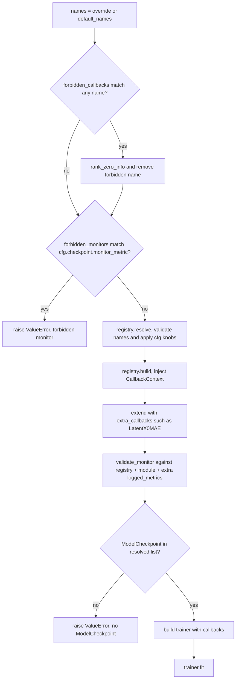

# Callback registry and training spine

`CallbackRegistry` (ADR-0029) is the typed name → spec dispatcher that replaced
the ad-hoc `_build_callbacks` / `_build_checkpoint` clones that used to live in
every training CLI. `TrainingSpine` (ADR-0032) is the **single caller** of that
registry: it owns the `default_names → override → forbidden → resolve → build
→ extra → validate → no-ckpt → trainer → fit` sequence, plus the post-merge
`forbidden_callbacks` / `forbidden_monitors` guards that let a shell drop a
callback no YAML or `--callbacks` override can re-enable. Every training CLI
now ends with `spine.run(...)`; the CLI's only responsibility left is seeding,
building the module + datamodule, and computing its dynamic default
callback-name set.

This page documents the spec contract, the two-phase construction, the
post-resolve monitor validation, and the spine's merge order — the load-bearing
pieces of any callback addition, knob rename, or "drop FID on the GRPO
ControlNet path" change.

## Spec contract

Every callback registered with the registry is a `@dataclass` class with two
things (`src/manifold/training/callbacks/registry.py`):

1. **Knobs as dataclass fields** (with defaults). The field set is the
   allow-list used by `CallbackRegistry.resolve` to reject unknown knobs with a
   loud `ValueError` before any `pl.Callback` is built.
2. **A `build(self, ctx: CallbackContext) -> pl.Callback` method** that takes
   the runtime-objects bag and returns a constructed Lightning callback.

Specs match the `CallbackSpec` Protocol structurally — no inheritance
(`manifold.training.callbacks.registry.CallbackSpec`). A spec may optionally
expose:

- `logged_metrics: frozenset[str]` — declared as a `ClassVar` (so it stays out
  of the dataclass knob surface) on any spec whose built callback emits a
  metric. `validate_monitor` unions it with the module's and any extra
  callbacks' `logged_metrics` to decide whether a checkpoint's
  `monitor_metric` is actually emitted.
- `monitor_metric: str | None` — the special-case field `validate_monitor`
  scans for (only `CheckpointSpec` declares it).

`CallbackRegistry.register` enforces that the spec class is a `@dataclass` —
the unknown-knob allow-list is built from `dataclasses.fields(spec_cls)` at
`resolve` time, so a non-dataclass spec would silently lose validation.

## Two-phase construction

ADR-0029 splits spec instantiation from callback construction because
generative callbacks such as FID need runtime objects (the VAE, inference
recipe, and feature network) that do not exist at config resolution. ADR-0037
accepts the same construction shape for an in-training paired PSNR/SSIM
callback — the `PairedFidelitySpec` is implemented and exported from
`callbacks/__init__.py`, but only the supervised `controlnet_cli` shell
registers it; the other three shells (JiT, GRPO, reward) keep their registry
to the per-mode spec set.

- **`CallbackRegistry.resolve(names, cfg)` (config-time)** — validates the
  requested name list and the per-name knob dict, then returns constructed spec
  instances in `names` order. Unknown name → `KeyError` with the registered
  set; unknown knob for a known name → `ValueError` with the allowed set.
  The list is **rank-symmetric** by contract (every DDP rank gets the same CLI
  args from `torchrun`); the registry does not collective-verify that, by
  design — see the ADR-0029 rejected-options note on the
  "rank-asymmetric callback list" hypothetical.
- **`CallbackRegistry.build(specs, ctx)` (fit-prep)** — injects the runtime
  `CallbackContext` (the module, VAE, datamodule, inference recipe, model dir,
  seed, optional lazy `feature_net_factory`, optional direct `feature_net`,
  optional `real_latents`) and returns the constructed `pl.Callback` list.

A callback that needs neither a knob nor a runtime object (e.g. `TrainLossSpec`)
is fine with empty fields and an empty `ctx`; the registry does not enforce a
minimum surface.

## Post-resolve monitor validation

`CallbackRegistry.validate_monitor(specs, module, extra_callbacks=None)` runs
**after** resolve/build, **before** the trainer is built. The contract:

- If no checkpoint spec is present, or its `monitor_metric` is `None`
  (the unmonitored periodic / last path), validation is a no-op — absence is
  the intended fallback when no held-out validation is wired (the JiT
  no-held-out-val production case, the reward-DDP fallback).
- Otherwise the `monitor_metric` must be present in the union of:
  - every spec's `logged_metrics` (the registry path: `FIDSpec` logs
    `val/fid`, `PairedFidelitySpec` logs `val/psnr` / `val/ssim`,
    `TrainLossSpec` logs `train/loss_epoch`),
  - the `module.logged_metrics` attribute (the Module-declared path: the
    reward module declares `val/gen_pair_acc` / `val/pair_acc` / `val/roc_auc`;
    `GRPOModule` declares `val/mean_reward`),
  - every `extra_callbacks` member's `logged_metrics` (the hand-appended path:
    `LatentX0MAE` declares `val/x0_mae`, see `src/manifold/training/metrics.py`).

A `monitor_metric` that is logged by nobody raises `ValueError` with the
available set — so Lightning does not error mid-fit on a never-logged monitor.
The `extra_callbacks` scan lets the JiT and ControlNet shells monitor
`val/x0_mae` without mutating `module.logged_metrics` — the shell just appends
`LatentX0MAE()` and the registry picks the metric up from the instance's
`logged_metrics` attribute.

This validation is the safety net behind the GRPO ControlNet fid guard (see
below) and behind the `tests/test_callback_registry.py` monitor tests.

## Built-in specs

| Spec | Knobs (defaults) | Built callback | `logged_metrics` |
|---|---|---|---|
| `TrainLossSpec` | (none) | `pl.Callback` logging `train/loss_epoch` | `frozenset({"train/loss_epoch"})` |
| `FIDSpec` | `num_synth=16`, `every_n_epochs=1`, `center_slices_ratio=0.5`, `cov_ridge=1e-6` | `FIDCallback` (rank-strided, lazy feature-net, JiT lazy real-latents) | `frozenset({"val/fid"})` |
| `CheckpointSpec` | `monitor_metric=None`, `save_top_k=3`, `save_last=True`, `every_n_epochs=1`, `mode="min"`, `filename=None` | `pl.callbacks.ModelCheckpoint` (monitored vs unmonitored two branches) | n/a (`validate_monitor` reads `monitor_metric` defensively) |
| `PairedFidelitySpec` | `subset_size=8`, `every_n_epochs=1`, `num_inference_steps=None`, `seed=0` | `PairedFidelityCallback` (fixed paired subset, Heun rollout, observe-only) | `frozenset({"val/psnr", "val/ssim"})` |

`CheckpointSpec.build` reproduces the prior `_build_checkpoint` two-branch
construction: `monitor_metric=None` keeps `save_top_k=1` plus `last.ckpt` at
the `every_n_epochs` cadence (the JiT production fallback); the monitored
branch tracks `monitor_metric` top-`k` plus last. The `filename` default picks
`unet3d-{epoch:03d}-{step}-{monitor:.3f}` for the monitored path and
`unet3d-{epoch:03d}-{step}` for the unmonitored path
(`src/manifold/training/callbacks/checkpoint.py`).

`PairedFidelitySpec` is exported from `callbacks/__init__.py` and is **only
registered by the supervised `controlnet_cli` shell** (its default name list is
`["train_loss", "checkpoint", "paired_fidelity"]`); the JiT, GRPO, and reward
shells do not call `register("paired_fidelity", ...)`, so a `--callbacks
paired_fidelity` on those paths fails fast with `KeyError` at resolve. The
monitor is observe-only: `validate_monitor` accepts a `val/psnr` /
`val/ssim` checkpoint monitor, but the supervised shell keeps the checkpoint
on `val/x0_mae` (the hand-appended `LatentX0MAE`'s metric) so the paired
fidelity never enters the checkpoint selection.

## TrainingSpine.run — the merge order

`TrainingSpine.run` is a single method, parameterized by named arguments
rather than a per-shell subclass (composition, not inheritance — the project's
OOP rule). The merge order is:

1. `names` = `callback_names_override` if set, otherwise `default_names`
   (the per-shell dynamic default callback list — e.g. the JiT shell starts
   with `["train_loss", "fid"? ,"checkpoint"]` (FID dropped when
   `enable_fid=False`), the GRPO shell with `["checkpoint"]` (or
   `["checkpoint", "fid"]` only when the FID-triple is present and the policy
   is not a ControlNet), the reward shell with `["checkpoint"]`, and the
   supervised ControlNet shell with
   `["train_loss", "checkpoint", "paired_fidelity"]`).
2. `forbidden_callbacks` is applied **after** the override. Each name in the
   map is force-removed from the merged list with a `rank_zero_info` log
   line. This is the load-bearing guard: a YAML knob or `--callbacks`
   override cannot re-enable a forbidden callback. The GRPO ControlNet path
   passes `forbidden_callbacks={"fid": "constant frozen-base metric"}` so the
   FID callback is dropped for that policy even if a stale recipe lists it.
3. `forbidden_monitors` rejects a `callback_cfg.checkpoint.monitor_metric`
   before resolution. The same GRPO ControlNet path passes
   `forbidden_monitors={"val/fid": ...}` so any checkpoint `monitor_metric:
   val/fid` raises `ValueError` instead of silently resuming on a constant
   metric.
4. `registry.resolve(names, callback_cfg)` validates the merged names and
   applies the per-name knob overrides from `callback_cfg` (the YAML
   `callbacks:` block + the `--callbacks` CLI override's `cfg`).
5. `registry.build(specs, ctx)` constructs the `pl.Callback` list with the
   runtime `CallbackContext`.
6. `extra_callbacks` (e.g. the hand-appended `LatentX0MAE`) are appended.
7. `validate_monitor` checks the checkpoint's `monitor_metric` against the
   union of registry + module + extra `logged_metrics`.
8. If no `ModelCheckpoint` survives the merge (an override dropped it),
   `raise ValueError("...no ModelCheckpoint in resolved list...")`.
9. `build_trainer(callbacks=callbacks)` + `trainer.fit(module, datamodule=...)`.


*Figure: `TrainingSpine.run` merge order — names → `forbidden_callbacks` → `forbidden_monitors` → resolve (with cfg knobs) → build → extra_callbacks → validate_monitor → no-ckpt check → trainer → fit.*

The no-`ModelCheckpoint` fail-fast (step 8) raises `ValueError("...no
ModelCheckpoint in resolved list...")` rather than letting `next(...)` raise
`StopIteration` deeper in the call
(`tests/test_callback_registry.py::test_training_spine_fails_fast_without_checkpoint`,
codex #170 P2).

The forbidden-callbacks guard is the documented externalization of the
former "GRPO ControlNet fid" special case: it lives generically in the spine,
not in any GRPO vocabulary
(`tests/test_callback_registry.py::test_training_spine_forbidden_callbacks_force_removed_post_merge`,
ADR-0032).

## Change guidance

- **Adding a callback:** add a `@dataclass` spec under
  `src/manifold/training/callbacks/`, expose it from
  `src/manifold/training/callbacks/__init__.py`, register it in each CLI's
  `spine.registry.register(...)` block (the shell that should ship with the
  callback; not every shell has to), and add a `train_loss`-style logger
  callback if it logs a monitored metric. Compose `CallbackContext` if the
  spec needs a runtime object not already in the bag.
- **Implementing ADR-0037 on the supervised stage (done) and on the GRPO
  stage (follow-up):** the supervised shell already registers
  `PairedFidelitySpec`, fills `CallbackContext.inference_recipe` from
  `controlnet.num_inference_steps`, and routes the paired-subset source
  through `ctx.datamodule` (`getattr(datamodule, "val_latent_ds", datamodule)`,
  F5). The remaining piece is the **ControlNet-GRPO extension** — the
  blanket `forbidden_callbacks={"fid": ...}` would have to release this
  callback specifically (its rationale, "unconditional rollout ignores the
  ControlNet," does not cover a paired rollout that uses `controlnet_rollout`)
  and the VAE-on-GPU decode path would have to land. Until that follow-up
  ADR ships, do not add `paired_fidelity` to a GRPO default or remove the
  `val/fid` monitor ban for it. The full extension surface is tracked in
<!-- openwiki: broken internal link [evaluation.md#accepted-in-training-monitor-planned-not-active] heading anchor "accepted-in-training-monitor-planned-not-active" does not exist in "evaluation.md". Fix the href or restore the target, then delete this comment. -->
  [Before/after GRPO evaluation](evaluation.md#accepted-in-training-monitor-planned-not-active).
- **Renaming a knob:** rename the dataclass field. `resolve` will start
  rejecting the old name in any recipe that still uses it — that loud
  `ValueError` is the contract's signal that all recipe sites need an update.
- **Adding a knob with a non-default:** same as above; recipes that omit it
  inherit the new default.
- **Dropping a callback for one policy:** prefer `forbidden_callbacks` over
  hard-coding the absent name into `default_names`. The forbidden map is the
  loud, post-merge, override-resistant guard.
- **Adding a new monitored metric:** make sure the emitting side declares it
  either as a spec's `logged_metrics` (registry path), the module's
  `logged_metrics` (Module-declared path — `RewardModule` /
  `GRPOModule`), or an `extra_callbacks` member's `logged_metrics`
  (`LatentX0MAE`'s `val/x0_mae`). Otherwise `validate_monitor` rejects any
  checkpoint that monitors it.

## Source map

- Spec contract + registry: `src/manifold/training/callbacks/registry.py`
- Runtime objects bag: `src/manifold/training/callbacks/context.py`
- Built-in specs:
  `src/manifold/training/callbacks/{train_loss,fid,checkpoint,paired_fidelity}.py`
- Spec barrel: `src/manifold/training/callbacks/__init__.py`
- Spine implementation: `src/manifold/training/core.py`
- CLI callers:
  - `src/manifold/training/cli.py` (JiT — registers `train_loss`, `fid`,
    `checkpoint`)
  - `src/manifold/training/reward_cli.py` (registers `train_loss`,
    `checkpoint`)
  - `src/manifold/training/grpo_cli.py` (registers `train_loss`, `fid`,
    `checkpoint`; uses `forbidden_callbacks` / `forbidden_monitors` on the
    ControlNet policy path)
  - `src/manifold/training/controlnet_cli.py` (registers `train_loss`,
    `checkpoint`, `paired_fidelity`)
- Hand-appended extra callbacks scanned for `logged_metrics`:
  `src/manifold/training/metrics.py` (`LatentX0MAE.logged_metrics = {"val/x0_mae"}`)
- Module-declared `logged_metrics` paths:
  `src/manifold/modules/reward.py` (`val/gen_pair_acc` / `val/pair_acc` /
  `val/roc_auc`), `src/manifold/modules/grpo.py` (`val/mean_reward`)
- Trainer builder (called by the spine): `src/manifold/training/trainer.py`

## Focused tests

- `tests/test_callback_registry.py::test_resolve_fails_fast_on_unknown_name`,
  `test_resolve_fails_fast_on_unknown_knob_for_known_name`,
  `test_unknown_knob_against_fielded_spec` — config-time validation
- `tests/test_callback_registry.py::test_validate_monitor_fails_on_unlogged_metric`,
  `test_validate_monitor_passes_on_module_declared_metric`,
  `test_validate_monitor_accepts_extra_callback_logged_metric`,
  `test_validate_monitor_fails_when_extra_callback_omits_metric`,
  `test_validate_monitor_none_bypasses_validation` — post-resolve monitor
  validation paths
- `tests/test_callback_registry.py::test_paired_fidelity_spec_builds_callback_with_knobs`,
  `test_paired_fidelity_spec_resolve_fails_fast_on_unknown_knob`,
  `test_paired_fidelity_spec_declares_logged_metrics`,
  `test_validate_monitor_accepts_psnr_and_ssim`,
  `test_paired_fidelity_spec_keeps_checkpoint_monitor_on_x0_mae`,
  `test_paired_fidelity_spec_reads_num_inference_steps_from_recipe` — ADR-0037
  supervised spec + observe-only contract
- `tests/test_callback_registry.py::test_training_spine_fails_fast_without_checkpoint`
  — codex #170 P2 (no-`ModelCheckpoint` `ValueError`)
- `tests/test_callback_registry.py::test_training_spine_forbidden_callbacks_force_removed_post_merge`,
  `test_training_spine_forbidden_monitor_raises` — ADR-0032 forbidden guards
- `tests/test_training_cli.py::test_*` covering CLI × spine integration

## Minimal validation

```bash
pytest tests/test_callback_registry.py -q
```

For a knob rename that touches one spec, also run that CLI's focused tests
(reward → `test_reward_cli.py`, JiT → `test_training_cli.py`, GRPO →
`test_grpo_cli.py` if present, ControlNet → `test_controlnet_cli.py`).
