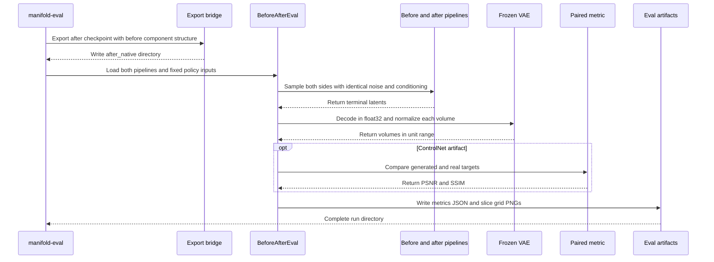

# Before/after GRPO evaluation

## When to use this page

Consult this page when adding or changing the shipped `manifold-eval` entry point, a paired-fidelity scalar, the before/after eval driver, evaluation artifacts, the report builder, or the in-training paired-fidelity monitor on the supervised ControlNet stage. The evaluation workflow composes the [checkpoint-to-native export contract](workflows.md#checkpoint-and-export-contract) and is structurally dependent on the persisted `model_index.json` contract documented in [Architecture and source map](architecture.md#configuration-and-persistence).

The subsystem has four layers:

1. `src/manifold/eval/cli.py` owns the `manifold-eval` console entry and infers the policy from the before native artifact.
2. `src/manifold/eval/before_after.py` owns the policy-agnostic same-noise generation, decode, normalization, scoring, and grid-writing flow.
3. `src/manifold/metrics/paired.py` owns the MONAI-backed 3D PSNR/SSIM metric for ControlNet pairs. Its sibling `src/manifold/metrics/paired_callback.py` owns the in-training monitor on the supervised stage.
4. `src/manifold/eval/comparison_page.py` turns the written metrics and PNGs into a self-contained HTML report. It is library-only, not a console command.

The public `manifold.eval` barrel exports `BeforeAfterEval`, `BeforeAfterResult`, `SliceGrid`, `ComparisonPageBuilder`, `JitComparison`, and `ControlNetComparison` from `src/manifold/eval/__init__.py`. The only shipped console surface is `manifold-eval`, registered in `pyproject.toml` as `manifold-eval = "manifold.eval.cli:main"`.

## Runtime flow



*Figure: `manifold-eval` exports the after policy, samples both sides under paired noise, decodes and scores them, and writes portable evaluation artifacts.*

The driver creates a same-noise contract in two ways:

- **JiT / unconditional:** each pipeline receives a fresh generator on the same device with the same `seed`; both produce the same Gaussian start noise.
- **ControlNet / paired:** one noise tensor is drawn for the batch and passed to both `sample_latent` calls. The source latent, real target latent, spacing, contrast labels, and Heun step count stay fixed.

This makes differences attributable to the policy weights rather than random sampling. `BeforeAfterEval` is intentionally injectable: callers can replace its `fidelity` scorer or `grid` renderer, and the CLI can replace real ControlNet data loading with `pairs_provider` in focused smoke tests.

## Policy dispatch and artifact contract

`_pipeline_class_of` reads `pipeline_class` from the before directory's `model_index.json`. There is no evaluation mode flag:

| `pipeline_class` | Resulting path | Evaluation input |
|---|---|---|
| `LatentFlowPipeline` | `run_unconditional` | `--latent-shape`, `--num-samples`, `--modality`, `--spacing`, and fixed seed |
| `ControlNetLatentFlowPipeline` | `run_paired` | held-out `src`/`tgt` latent pairs, spacing, contrast labels, and fixed seed |

The CLI loads a probe pipeline from the before export, uses its UNet/VAE/scheduler structure to run the existing `export_to_native` bridge, and writes the after policy to `<output>/after_native`. It then reloads both native exports into fresh pipelines. A ControlNet after export reuses the before export's frozen base; only the after checkpoint's trainable `controlnet.*` weights are baked.

The before export remains independent because the export bridge mutates the loaded probe components in place. The ControlNet real-data path also reuses `build_brats_pair_manifest`, `_train_val_manifests`, and the warmed paired latent cache; it applies the before VAE's `scaling_factor` rather than re-estimating it. A held-out validation split is mandatory, either through `--val-data-base-dir` or a positive `--val-fraction`.

## Running the shipped workflow

For JiT, generate unconditional before/after grids:

```bash
manifold-eval \
  --before-dir runs/jit_native \
  --after-ckpt runs/grpo_jit/last.ckpt \
  --output runs/eval_jit \
  --device cuda
```

For ControlNet, evaluate matched translations against held-out real targets:

```bash
manifold-eval \
  --before-dir runs/controlnet_native \
  --after-ckpt runs/grpo_controlnet/last.ckpt \
  --output runs/eval_controlnet \
  --data-base-dir data/brats \
  --val-data-base-dir data/brats_val \
  --latents-dir runs/paired_latents \
  --target-dim 256,256,128 \
  --num-pairs 8 \
  --device cuda
```

Shared controls are `--seed`, `--num-inference-steps`, and `--device`. ControlNet-only controls are `--data-base-dir`, `--val-data-base-dir`, `--val-fraction`, `--latents-dir`, `--cache-tag`, `--target-dim`, `--num-pairs`, `--src-label`, and `--tgt-label`.

## Outputs and metric semantics

`BeforeAfterEval` writes one 2.5D PNG per sample. Each grid has three orthogonal center slices (`xy`, `yz`, `zx`) and columns for the policy outputs:

- JiT: `before | after`.
- ControlNet: `before | after | real target`.

`metrics.json` records the policy, seed, inference-step count, sample count, grid basenames, and the before/after values that apply. For ControlNet the generated target and real target are each VAE-decoded and passed through the shared `min_max_to_unit` helper before MONAI scoring. The grid and HTML files use atomic replacement writes, and grid references in JSON are basenames so the report remains portable after the eval directory is moved.

### Paired-fidelity metric

`PairedFidelityMetrics` takes generated and real tensors with equal `[B,C,D,H,W]` shape, already normalized to `[0,1]`. It composes MONAI `PSNRMetric(max_val=1.0)` and `SSIMMetric(spatial_dims=3, data_range=1.0)`, then batch-means both outputs. PSNR is reported in dB and is `+inf` for zero-error/identical volumes; SSIM is bounded by MONAI's metric and equals `1.0` for identical volumes.

`min_max_to_unit` normalizes each decoded volume independently. A constant/degenerate volume maps to zeros instead of dividing by zero. Do not compare unnormalized VAE output, or change the metric's default data range without updating both the ControlNet pipeline and eval paths; that would make in-training and offline measurements diverge. The MONAI 3D SSIM default window also requires spatial extents that fit its configured window, so production smoke fixtures should not shrink every axis below the supported window size.

Unlike unconditional JiT evaluation, paired fidelity is full-reference: it requires a real target. It complements rather than replaces the realism reward, which is deliberately fidelity-blind. As recorded in ADR-0036, offline PSNR/SSIM is the apples-to-apples GRPO comparison; the unconditional JiT continues to use shared `val/fid` plus reward trajectory.

## From metrics to a shareable comparison

`ComparisonPageBuilder.build` accepts `JitComparison(eval_dir, before_csv, after_csv)` and optionally `ControlNetComparison(eval_dir)`. It reads `metrics.json`, optionally reads JiT `val/fid` and `val/mean_reward` series from Lightning `metrics.csv` files, and embeds both generated curves and slice grids as base64 PNG data URIs. The result has no external image, stylesheet, or script dependencies and can be written atomically to an `out_path`.

The page deliberately explains the metric split: JiT is reference-free and uses FID, while ControlNet has a real target and uses PSNR/SSIM. If a ControlNet eval directory is not supplied, the builder emits a clearly marked pending slot rather than inventing a comparison. This API is imported from `manifold.eval`; unlike `manifold-eval`, it is not registered in `[project.scripts]`.

## In-training monitor: supervised stage shipped, ControlNet-GRPO is the follow-up

ADR-0037 corrects ADR-0036's training-era silence by accepting an observe-only in-training paired-fidelity monitor. The **supervised ControlNet stage is shipped**: the callback, the registry spec, and the supervised CLI wiring all exist, and the only remaining work is the deliberate ControlNet-GRPO follow-up.

### Supervised stage: implemented and registered

The shipped surface is:

- `PairedFidelityCallback` (`src/manifold/metrics/paired_callback.py`, exported from `manifold.metrics`) — on every gated validation epoch it rolls a **fixed paired subset** through the module's own `controlnet_rollout`, VAE-decodes generated and real target, normalizes both via `min_max_to_unit`, and scores them with `PairedFidelityMetrics`. The two `torchmetrics.MeanMetric` instances are attached to the module so Lightning registers and restores them like `LatentX0MAE`. DDP runs the same fixed subset redundantly on every rank (DDP-synchronized weights + identical seeded noise ⇒ identical result), so the only cross-rank reduction is Lightning's torchmetrics sync — no FID-style sharding, no error rendezvous. All work runs under `inference_mode`, so no gradient is ever formed.
- `PairedFidelitySpec` (`src/manifold/training/callbacks/paired_fidelity.py`, exported from `manifold.training.callbacks`) — the registry spec matching the `CallbackSpec` Protocol: `@dataclass(frozen=True)` knobs `subset_size=8`, `every_n_epochs=1`, `num_inference_steps=None`, `seed=0`; `logged_metrics = frozenset({"val/psnr", "val/ssim"})` so `validate_monitor` would accept either as a checkpoint monitor (a future opt-in). Its `build(ctx)` injects `ctx.module`, `ctx.vae`, and `ctx.datamodule` (the paired-subset source, lazily resolved to `val_latent_ds` at the first gated epoch, F5) into the callback. The rollout step count is **recipe-primary**: with the per-callback knob unset it reads `num_inference_steps` from `ctx.inference_recipe`; an explicit knob overrides the recipe; with neither it falls back to the callback's own default of 15.
- `run_controlnet_training` (`src/manifold/training/controlnet_cli.py`) registers `PairedFidelitySpec` under the name `paired_fidelity`, includes it in the supervised default callback list (`["train_loss", "checkpoint", "paired_fidelity"]`), and fills `CallbackContext.inference_recipe = {"num_inference_steps": int(num_inference_steps)}` from the existing `controlnet.num_inference_steps` knob. Other shells (JiT, GRPO, reward) do not register the spec, so a `--callbacks paired_fidelity` on those paths fails fast with `KeyError` at resolve.
- Supervised ControlNet validation continues to monitor `val/x0_mae`; the callback never drives checkpoint selection, never contributes loss, and never touches the optimizer or EMA. The DDP-safety test (`tests/test_paired_fidelity_ddp.py`) verifies no-hang, identical `val/psnr`/`val/ssim` across ranks, and that `val/x0_mae` remains the checkpoint monitor.

### ControlNet-GRPO follow-up: not yet shipped

ADR-0037 explicitly defers the ControlNet-GRPO extension as a separate ticket. The remaining surface is:

1. Release `paired_fidelity` from the blanket `forbidden_callbacks={"fid": ...}` that the ControlNet-GRPO path applies — its rationale ("unconditional rollout ignores the ControlNet") does not cover a paired rollout that uses `controlnet_rollout`. A targeted `forbidden_callbacks` exception for `paired_fidelity` alone keeps `fid` banned while admitting the paired monitor.
2. Keep the VAE on the rollout GPU for the monitor's decode (the supervised stage `VaeStage` already restores the VAE to CPU after each gated epoch; the GRPO path must hold it).
3. Wire `PairedFidelitySpec` into the ControlNet-GRPO default callback set, with `ctx.inference_recipe` populated from the GRPO recipe's paired-rollout step count.
4. Extend the focused registry, DDP, and module tests for the new policy path; the supervised DDP gate (`test_paired_fidelity_ddp.py`) is the load-bearing precedent.

Until the follow-up lands, `manifold-train-grpo` with a ControlNet `--native-dir` does not log `val/psnr` / `val/ssim`. The offline `manifold-eval` comparison (with the paired after checkpoint + held-out validation pairs) remains the apples-to-apples ControlNet fidelity number; the in-training supervised curve and the offline comparison share the metric, normalization, and rollout so the two are directly comparable.

## Change guidance

### Change sampling or add a new policy

Start in `BeforeAfterEval` and preserve the paired-input contract. Policy detection then belongs in `_pipeline_class_of`; add the concrete pipeline to the known mapping and pass real policy-specific inputs through the CLI. Validate both driver-level same-pipeline identity and CLI end-to-end artifact routing.

### Change PSNR, SSIM, or normalization

Change the metric contract in `src/manifold/metrics/paired.py`, re-export names from `src/manifold/metrics/__init__.py`, and update every consumer that must remain comparable. A normalization change crosses `src/manifold/pipelines/pipeline_utils.py`, `controlnet_latent_flow.py`, and `before_after.py`; it is not an eval-only change. The in-training monitor and the offline comparison must keep sharing `min_max_to_unit` and `PairedFidelityMetrics(data_range=1.0)` so their curves remain comparable.

### Add or change report content

Treat `BeforeAfterResult.metrics` and the persisted JSON/PNG layout as the source contract. Update `ComparisonPageBuilder`, both comparison test fixtures, and the in-tree builder tests. Keep `ComparisonPageBuilder` library-only unless a separate decision introduces a new console command; artifact assembly is intentionally outside `manifold-eval` runtime.

### Add a console entry

Register the callable in `pyproject.toml` and ensure the executable is exercised from a real subprocess or equivalent installed-command smoke, not only an in-process import. For `manifold-eval`, retain `main(argv=None)` as the consumer seam and keep the before-artifact policy inference free of a mode flag.

### Extend the in-training paired-fidelity monitor to ControlNet-GRPO

The supervised stage is already wired; do not re-author it. For the GRPO follow-up you must:

- Release the `forbidden_callbacks={"fid": ...}` guard on the ControlNet-GRPO path **for `paired_fidelity` only** — a targeted per-name exception, not a blanket loosening.
- Extend `run_controlnet_training` (or its GRPO analog) to populate `CallbackContext.inference_recipe` with the GRPO paired-rollout step count and register `PairedFidelitySpec` in the policy's default callback set.
- Keep the VAE on the rollout device for the monitor's decode (`VaeStage` already does the staging; the GRPO path must simply not free it between gated epochs).
- Keep checkpoint selection on `val/mean_reward` and observe-only semantics — the GRPO path's `forbidden_monitors={"val/fid": ...}` guard must continue to reject `val/fid`.
- Add a focused DDP test (mirror of `test_paired_fidelity_ddp.py`) and a GRPO-policy callback-registry test that mirrors `test_paired_fidelity_spec_*` from `tests/test_callback_registry.py`.

Update the [callback registry](callback-registry.md#change-guidance) and the [GRPO workflow](workflows.md#reward-and-grpo-stages) when the new symbols, default callback names, and forbidden-callback exception land.

## Focused tests and minimal validation

| Behavior | Existing test anchor |
|---|---|
| Metric identity, known PSNR, perturbation monotonicity, 3D input, and shape rejection | `tests/test_paired_fidelity.py` |
| JiT and ControlNet same-seed/same-pipeline identity, normalization, paired columns, scores, and reproducible grids | `tests/test_before_after_eval.py` |
| Console policy routing, after-export weight bake, held-out data loading, and required inputs | `tests/test_eval_cli.py` |
| Self-contained HTML, metric explanation, curves, grids, pending slot, and output file | `tests/test_comparison_page.py` |
| In-training monitor: hook wiring, gating, observe-only contract, recipe-primary step count, spec → callback translation | `tests/test_paired_fidelity_callback.py`, `tests/test_callback_registry.py::test_paired_fidelity_spec_*` |
| In-training monitor DDP: no-hang, redundant-subset identity, observe-only checkpoint monitor | `tests/test_paired_fidelity_ddp.py` |

Run the full focused evaluation surface with:

```bash
pytest tests/test_paired_fidelity.py tests/test_before_after_eval.py tests/test_eval_cli.py tests/test_comparison_page.py -q
```

For a fast first pass, run `pytest tests/test_paired_fidelity.py tests/test_before_after_eval.py -q`; the CLI and report-builder tests are still required when crossing the installed console or artifact/presentation boundary, and the in-training monitor tests (`tests/test_paired_fidelity_callback.py`, `tests/test_paired_fidelity_ddp.py`, the `test_paired_fidelity_spec_*` block in `tests/test_callback_registry.py`) are required whenever the supervised stage's monitor seam is touched. Also consult [Operations and testing](operations-and-testing.md#standard-checks) for the repository test matrix and the conditions that make broader DDP or packaging checks necessary.
