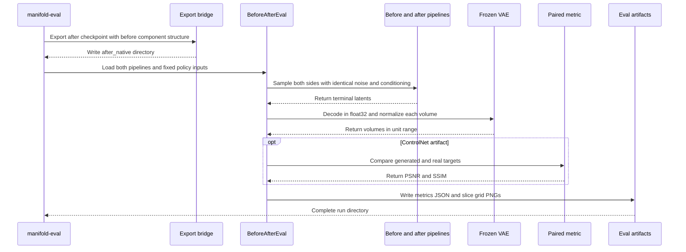
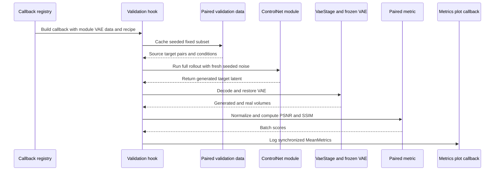

# Before/after GRPO evaluation

## When to use this page

Consult this page when adding or changing either paired-fidelity lifecycle: the default-on observe-only monitor during supervised ControlNet training, or the shipped `manifold-eval` before/after workflow. It covers the [training callback surface](callback-registry.md#paired-fidelity-shipped-surface), composes the [checkpoint-to-native export contract](workflows.md#checkpoint-and-export-contract), and depends on the persisted `model_index.json` contract documented in [Architecture and source map](architecture.md#configuration-and-persistence).

The subsystem has seven ownership layers:

1. `src/manifold/metrics/paired_callback.py` owns the in-training hook: fixed-subset selection, seeded full rollout, decode, normalization, and metric logging.
2. `src/manifold/training/callbacks/paired_fidelity.py` owns the registry spec and its config/runtime seam.
3. `src/manifold/training/controlnet_cli.py` enables the callback by default and injects the supervised module, VAE, datamodule, and rollout recipe.
4. `src/manifold/eval/cli.py` owns the `manifold-eval` console entry and infers the offline policy from the before native artifact.
5. `src/manifold/eval/before_after.py` owns the policy-agnostic same-noise generation, decode, normalization, scoring, and grid-writing flow.
6. `src/manifold/metrics/paired.py` owns the shared MONAI-backed 3D PSNR/SSIM metric used by both lifecycles.
7. `src/manifold/eval/comparison_page.py` turns the written metrics and PNGs into a self-contained HTML report. It is library-only, not a console command.

`PairedFidelityCallback` and `VaeStage` are exported from `manifold.metrics`; `PairedFidelitySpec` is exported from `manifold.training.callbacks`. There is no second generated or publish mirror. The public `manifold.eval` barrel exports `BeforeAfterEval`, `BeforeAfterResult`, `SliceGrid`, `ComparisonPageBuilder`, `JitComparison`, and `ControlNetComparison`; the only offline console surface is `manifold-eval = "manifold.eval.cli:main"` in `pyproject.toml`.

## Runtime flow



*Figure: `manifold-eval` exports the after policy, samples both sides under paired noise, decodes and scores them, and writes portable evaluation artifacts.*

The driver creates a same-noise contract in two ways:

- **JiT / unconditional:** each pipeline receives a fresh generator on the same device with the same `seed`; both produce the same Gaussian start noise.
- **ControlNet / paired:** one noise tensor is drawn for the batch and passed to both `sample_latent` calls. The source latent, real target latent, spacing, contrast labels, and Heun step count stay fixed.

This makes differences attributable to the policy weights rather than random sampling. `BeforeAfterEval` is intentionally injectable: callers can replace its `fidelity` scorer or `grid` renderer, and the CLI can replace real ControlNet data loading with `pairs_provider` in focused smoke tests.

## Active in-training paired-fidelity monitor

`manifold-train-controlnet` enables `PairedFidelitySpec` by default. The callback
runs at `on_validation_epoch_end` on every gated validation epoch; a CLI/YAML
`callbacks` override can still remove it. It is a training observation loop, not
an extra call to `manifold-eval` and not a new checkpoint selector.



*Figure: The active training monitor resolves a fixed paired validation batch once, runs the full ControlNet rollout, reuses the VAE and paired metric, and records observe-only validation metrics.*

The lifecycle ordering and invariants are:

1. **Resolve data late.** `PairedFidelityCallback` receives the datamodule, not a
   concrete dataset. At the first gated epoch it resolves
   `datamodule.val_latent_ds` when present, so both the cold `_DedupValDataModule`
   and `PairedWarmDataModule` point at the post-setup held-out paired cache.
2. **Cache one fixed subset.** A generator seeded by `seed` chooses
   `min(subset_size, len(dataset))` indices. `default_collate` produces one
   source/target batch, and that exact cached batch is reused on later gated
   epochs. Only the model changes.
3. **Generate with fresh fixed noise.** Noise has the real target's batched shape,
   module dtype, and base-UNet device. `ControlNetLatentFlowModule.sample` uses the
   full ControlNet Heun rollout, so this is not the one-step proxy rejected by
   ADR-0037. Re-seeding each monitored epoch prevents sampler-state drift.
4. **Stage and decode the same VAE.** `VaeStage` snapshots the VAE CPU state,
   moves it to the base UNet's device, and restores state plus CPU placement on
   exit or enter failure. `LatentDecoder` disables MAISI `norm_float16`, and
   `VramStage` composes the same `VaeStage` for FID decode.
5. **Normalize and score in image space.** Generated and real volumes each pass
   through `min_max_to_unit`, then `PairedFidelityMetrics(..., data_range=1.0)`.
   The callback resets its two module-attached `MeanMetric`s before the single
   batch update and logs `val/psnr` and `val/ssim`.
6. **Keep the default observe-only.** `run_controlnet_training` keeps
   `val/x0_mae` for `ModelCheckpoint`; the callback adds no loss or optimizer
   gradient. Registry validation accepts either PSNR or SSIM as a monitor because
   the spec declares `logged_metrics`, but an explicit checkpoint override would
   intentionally leave ADR-0037's default contract.

`controlnet.num_inference_steps` is recipe-primary (15 Heun steps by default;
29 model evaluations). `PairedFidelitySpec` can override it, while
`subset_size`, `every_n_epochs`, and `seed` default to 8, 1, and 0. Programmatic
callers can pass these under `callback_cfg["paired_fidelity"]`; the current
shipped `main()` only forwards the recipe's rollout count, as recorded in the
[Quickstart backlog](quickstart.md#backlog).

Under DDP, every rank evaluates the same fixed subset and seed redundantly. The
only monitor-specific reduction is Lightning's synchronization of the two
module-attached `MeanMetric`s: DDP-synchronized weights, paired inputs, and noise
produce identical local scores. The small subset is deliberately not sharded;
sharding it would change the collective lifecycle and the current contract. The
2-rank proof checks no deadlock, equal local and synchronized values, finite
metrics, and preservation of the `val/x0_mae` checkpoint monitor.

`MetricsPlotCallback` automatically groups `val/psnr` and `val/ssim` into their
own small multiples and reads them from Lightning's `metrics.csv`. Its
`on_train_epoch_end` image lags validation metrics by one epoch because Lightning
flushes epoch metrics afterward; `on_fit_end` is the complete render. It ignores
non-finite points, so a legitimate `+inf` PSNR remains in Lightning logs but is
not a plotted data point.

## Policy dispatch and artifact contract

`_pipeline_class_of` reads `pipeline_class` from the before directory's `model_index.json`. There is no evaluation mode flag:

| `pipeline_class` | Resulting path | Evaluation input |
|---|---|---|
| `LatentFlowPipeline` | `run_unconditional` | `--latent-shape`, `--num-samples`, `--modality`, `--spacing`, and fixed seed |
| `ControlNetLatentFlowPipeline` | `run_paired` | held-out `src`/`tgt` latent pairs, spacing, contrast labels, and fixed seed |

The CLI loads a probe pipeline from the before export, uses its UNet/VAE/scheduler structure to run the existing `export_to_native` bridge, and writes the after policy to `<output>/after_native`. It then reloads both native exports into fresh pipelines. A ControlNet after export reuses the before export's frozen base; only the after checkpoint's trainable `controlnet.*` weights are baked.

The before export remains independent because the export bridge mutates the loaded probe components in place. The ControlNet real-data path also reuses `build_brats_pair_manifest`, `_train_val_manifests`, and the warmed paired latent cache; it applies the before VAE's `scaling_factor` rather than re-estimating it. A held-out validation split is mandatory, either through `--val-data-base-dir` or a positive `--val-fraction`.

## Running the shipped workflow

For JiT, generate unconditional before/after grids:

```bash
manifold-eval \
  --before-dir runs/jit_native \
  --after-ckpt runs/grpo_jit/last.ckpt \
  --output runs/eval_jit \
  --device cuda
```

For ControlNet, evaluate matched translations against held-out real targets:

```bash
manifold-eval \
  --before-dir runs/controlnet_native \
  --after-ckpt runs/grpo_controlnet/last.ckpt \
  --output runs/eval_controlnet \
  --data-base-dir data/brats \
  --val-data-base-dir data/brats_val \
  --latents-dir runs/paired_latents \
  --target-dim 256,256,128 \
  --num-pairs 8 \
  --device cuda
```

Shared controls are `--seed`, `--num-inference-steps`, and `--device`. ControlNet-only controls are `--data-base-dir`, `--val-data-base-dir`, `--val-fraction`, `--latents-dir`, `--cache-tag`, `--target-dim`, `--num-pairs`, `--src-label`, and `--tgt-label`.

## Outputs and metric semantics

`BeforeAfterEval` writes one 2.5D PNG per sample. Each grid has three orthogonal center slices (`xy`, `yz`, `zx`) and columns for the policy outputs:

- JiT: `before | after`.
- ControlNet: `before | after | real target`.

`metrics.json` records the policy, seed, inference-step count, sample count, grid basenames, and the before/after values that apply. For ControlNet the generated target and real target are each VAE-decoded and passed through the shared `min_max_to_unit` helper before MONAI scoring. The grid and HTML files use atomic replacement writes, and grid references in JSON are basenames so the report remains portable after the eval directory is moved.

### Paired-fidelity metric

`PairedFidelityMetrics` takes generated and real tensors with equal `[B,C,D,H,W]` shape, already normalized to `[0,1]`. It composes MONAI `PSNRMetric(max_val=1.0)` and `SSIMMetric(spatial_dims=3, data_range=1.0)`, then batch-means both outputs. PSNR is reported in dB and is `+inf` for zero-error/identical volumes; SSIM is bounded by MONAI's metric and equals `1.0` for identical volumes.

`min_max_to_unit` normalizes each decoded volume independently. A constant/degenerate volume maps to zeros instead of dividing by zero. Do not compare unnormalized VAE output, or change the metric's default data range without updating both the ControlNet pipeline and eval paths; that would make in-training and offline measurements diverge. The MONAI 3D SSIM default window also requires spatial extents that fit its configured window, so production smoke fixtures should not shrink every axis below the supported window size.

Unlike unconditional JiT evaluation, paired fidelity is full-reference: it requires a real target. It complements rather than replaces the realism reward, which is deliberately fidelity-blind. As recorded in ADR-0036, offline PSNR/SSIM is the apples-to-apples GRPO comparison; the unconditional JiT continues to use shared `val/fid` plus reward trajectory.

## From metrics to a shareable comparison

`ComparisonPageBuilder.build` accepts `JitComparison(eval_dir, before_csv, after_csv)` and optionally `ControlNetComparison(eval_dir)`. It reads `metrics.json`, optionally reads JiT `val/fid` and `val/mean_reward` series from Lightning `metrics.csv` files, and embeds both generated curves and slice grids as base64 PNG data URIs. The result has no external image, stylesheet, or script dependencies and can be written atomically to an `out_path`.

The page deliberately explains the metric split: JiT is reference-free and uses FID, while ControlNet has a real target and uses PSNR/SSIM. If a ControlNet eval directory is not supplied, the builder emits a clearly marked pending slot rather than inventing a comparison. This API is imported from `manifold.eval`; unlike `manifold-eval`, it is not registered in `[project.scripts]`.

### The two paired-fidelity lifecycles are complementary

The active in-training monitor and `manifold-eval` share `LatentDecoder`,
`min_max_to_unit`, and `PairedFidelityMetrics`, but they answer different questions
and have different lifecycles:

| Concern | In-training monitor | Offline `manifold-eval` |
|---|---|---|
| Policy snapshot | Current supervised ControlNet at each gated validation epoch | Separate before export and post-GRPO after export |
| Pairing | One cached fixed-subset batch; fresh seeded noise per monitored epoch | Before/after pairs held under identical noise and conditions |
| Output | `val/psnr`, `val/ssim`; no loss or checkpoint selection | `metrics.json`, 2.5D slice grids, and optional HTML comparison |
| DDP | Small subset redundantly evaluated on every rank | Native pipelines are reloaded; no monitor subset is sharded |

Do not route one through the other. The in-training callback is the per-epoch drift
screen; ADR-0036's before/after comparison remains the checkpoint-to-checkpoint
fidelity evaluation of record.

## Change guidance

### Change sampling or add a new policy

Start in `BeforeAfterEval` and preserve the paired-input contract. Policy detection then belongs in `_pipeline_class_of`; add the concrete pipeline to the known mapping and pass real policy-specific inputs through the CLI. Validate both driver-level same-pipeline identity and CLI end-to-end artifact routing.

### Change PSNR, SSIM, or normalization

Change the metric contract in `src/manifold/metrics/paired.py`, re-export names from `src/manifold/metrics/__init__.py`, and update every consumer that must remain comparable. A normalization change crosses `src/manifold/pipelines/pipeline_utils.py`, `controlnet_latent_flow.py`, and `before_after.py`; it is not an eval-only change.

### Add or change report content

Treat `BeforeAfterResult.metrics` and the persisted JSON/PNG layout as the source contract. Update `ComparisonPageBuilder`, both comparison test fixtures, and the in-tree builder tests. Keep `ComparisonPageBuilder` library-only unless a separate decision introduces a new console command; artifact assembly is intentionally outside `manifold-eval` runtime.

### Add a console entry

Register the callable in `pyproject.toml` and ensure the executable is exercised from a real subprocess or equivalent installed-command smoke, not only an in-process import. For `manifold-eval`, retain `main(argv=None)` as the consumer seam and keep the before-artifact policy inference free of a mode flag.

### Change the active in-training monitor

Keep the shipped surfaces synchronized: `PairedFidelityCallback`,
`PairedFidelitySpec`, their public barrels, `controlnet_cli.py` registration and
`CallbackContext`, the shared `VaeStage`/metric/decode helpers, the lazy
`val_latent_ds` accessor, automatic metric plotting, and the checkpoint default.
A change to subset execution, cadence, generation noise, or global reduction
needs both callback-level behavior tests and `tests/test_paired_fidelity_ddp.py`.
Keep ControlNet-GRPO out of this change unless its own ADR/ticket accepts the
extension; the current spec is deliberately supervised-stage-only.

## Focused tests and minimal validation

| Behavior | Existing test anchor |
|---|---|
| Metric identity, known PSNR, perturbation monotonicity, 3D input, and shape rejection | `tests/test_paired_fidelity.py` |
| In-training fixed subset, cadence, metric reset, normalization wiring, inference mode, and observe-only behavior | `tests/test_paired_fidelity_callback.py` |
| `PairedFidelitySpec` knobs, runtime injection, recipe-primary rollout count, monitor declaration, and checkpoint default | `tests/test_callback_registry.py` |
| Shared VAE stage/restore and enter-failure cleanup | `tests/test_fid_helpers.py` |
| 2-rank DDP no-deadlock, rank-local equality, synchronized metrics, and `val/x0_mae` checkpoint preservation | `tests/test_paired_fidelity_ddp.py` |
| JiT and ControlNet same-seed/same-pipeline identity, normalization, paired columns, scores, and reproducible grids | `tests/test_before_after_eval.py` |
| Console policy routing, after-export weight bake, held-out data loading, and required inputs | `tests/test_eval_cli.py` |
| Self-contained HTML, metric explanation, curves, grids, pending slot, and output file | `tests/test_comparison_page.py` |

Run the offline surface with:

```bash
pytest tests/test_paired_fidelity.py tests/test_before_after_eval.py tests/test_eval_cli.py tests/test_comparison_page.py -q
```

Run the active in-training callback surface with:

```bash
pytest tests/test_paired_fidelity_callback.py tests/test_callback_registry.py tests/test_fid_helpers.py tests/test_controlnet_cli.py -q
```

Run `pytest tests/test_paired_fidelity_ddp.py -q` when changing the monitor's
DDP execution, metric synchronization, fixed subset, or checkpoint interaction.
The CLI and report-builder tests remain required when crossing the installed
console or artifact/presentation boundary. Also consult
[Operations and testing](operations-and-testing.md#standard-checks) for the
repository test matrix and the conditions that make broader DDP or packaging
checks necessary.
