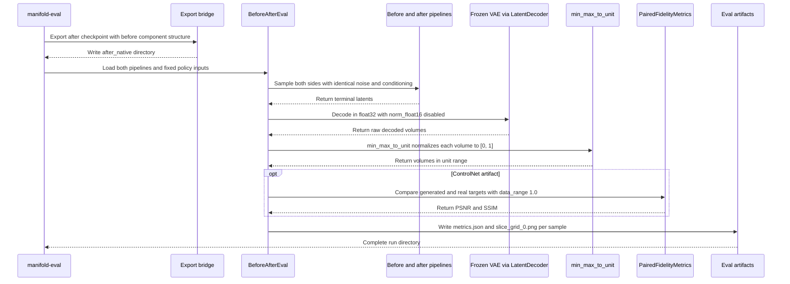

# Before/after GRPO evaluation

## When to use this page

Consult this page when adding or changing the shipped `manifold-eval` entry point, a paired-fidelity scalar, the before/after eval driver, evaluation artifacts, the offline comparison report builder, or the now-active in-training `PairedFidelityCallback` monitor that mirrors the offline PSNR/SSIM into a per-epoch supervised ControlNet validation step (ADR-0037). The evaluation workflow composes the [checkpoint-to-native export contract](workflows.md#checkpoint-and-export-contract) and is structurally dependent on the persisted `model_index.json` contract documented in [Architecture and source map](architecture.md#configuration-and-persistence).

The subsystem has four layers plus the active in-training companion:

1. `src/manifold/eval/cli.py` owns the `manifold-eval` console entry and infers the policy from the before native artifact (`LatentFlowPipeline` ⇒ unconditional JiT, `ControlNetLatentFlowPipeline` ⇒ paired ControlNet).
2. `src/manifold/eval/before_after.py` owns the policy-agnostic same-noise generation, decode, normalization, scoring, and grid-writing flow (`BeforeAfterEval` with `run_unconditional` / `run_paired`).
3. `src/manifold/metrics/paired.py` owns the MONAI-backed 3D PSNR/SSIM metric for ControlNet pairs; `src/manifold/metrics/paired_callback.py` owns the in-training `PairedFidelityCallback` that reuses the same metric, decode, and normalization under `torch.inference_mode()`.
4. `src/manifold/eval/comparison_page.py` turns the written metrics and PNGs into a self-contained HTML report. It is **library-only** — there is no `manifold-build-page` console entry, and every image is embedded as a base64 PNG data URI so the page has no external image, stylesheet, or script references.
5. `src/manifold/training/callbacks/paired_fidelity.py` registers `PairedFidelitySpec` on the `CallbackRegistry` (exported from `manifold.training.callbacks`) so the supervised ControlNet CLI can attach the monitor through the standard two-phase resolve/build path (ADR-0029 / [Callback registry and training spine](callback-registry.md)).

The public `manifold.eval` barrel exports `BeforeAfterEval`, `BeforeAfterResult`, `SliceGrid`, `ComparisonPageBuilder`, `JitComparison`, and `ControlNetComparison` from `src/manifold/eval/__init__.py`. The only shipped console surface is `manifold-eval`, registered in `pyproject.toml` as `manifold-eval = "manifold.eval.cli:main"`. The in-training monitor is library-level too: it is reached through `manifold.training.callbacks.PairedFidelitySpec` (the registry name) and `manifold.metrics.PairedFidelityCallback` (the implementation), and it ships with the supervised ControlNet CLI default callback set — never as a standalone console entry.

## Runtime flow


```mermaid
sequenceDiagram
    participant CLI as manifold-eval
    participant Bridge as Export bridge
    participant Core as BeforeAfterEval
    participant Policy as Before and after pipelines
    participant VAE as Frozen VAE via LatentDecoder
    participant Norm as min_max_to_unit
    participant Metric as PairedFidelityMetrics
    participant Files as Eval artifacts

    CLI->>Bridge: Export after checkpoint with before component structure
    Bridge-->>CLI: Write after_native directory
    CLI->>Core: Load both pipelines and fixed policy inputs
    Core->>Policy: Sample both sides with identical noise and conditioning
    Policy-->>Core: Return terminal latents
    Core->>VAE: Decode in float32 with norm_float16 disabled
    VAE-->>Core: Return raw decoded volumes
    Core->>Norm: min_max_to_unit normalizes each volume to [0, 1]
    Norm-->>Core: Return volumes in unit range
    opt ControlNet artifact
        Core->>Metric: Compare generated and real targets with data_range 1.0
        Metric-->>Core: Return PSNR and SSIM
    end
    Core->>Files: Write metrics.json and slice_grid_0.png per sample
    Files-->>CLI: Complete run directory
```

*Figure: `manifold-eval` exports the after policy, samples both sides under paired noise, decodes through the shared `LatentDecoder` + `min_max_to_unit` (the published-output convention), scores them when the policy is paired, and writes the portable evaluation artifacts. `ComparisonPageBuilder` is a separate, library-only assembly step that reads those artifacts plus training CSVs and embeds everything as base64 PNG data URIs.*

The driver creates a same-noise contract in two ways:

- **JiT / unconditional:** each pipeline receives a fresh generator on the same device with the same `seed`; both produce the same Gaussian start noise.
- **ControlNet / paired:** one noise tensor is drawn for the batch and passed to both `sample_latent` calls. The source latent, real target latent, spacing, contrast labels, and Heun step count stay fixed.

This makes differences attributable to the policy weights rather than random sampling. `BeforeAfterEval` is intentionally injectable: callers can replace its `fidelity` scorer or `grid` renderer, and the CLI can replace real ControlNet data loading with `pairs_provider` in focused smoke tests.

## Shared normalization contract: `min_max_to_unit`

The published-output convention is a single shared helper — `min_max_to_unit` in `src/manifold/pipelines/pipeline_utils.py` — and three sites call it for the same reason (the `[0, 1]` convention that lets `PairedFidelityMetrics` assume `data_range = 1.0`):

| Caller | Path | What it normalizes |
|---|---|---|
| ControlNet inference pipeline | `src/manifold/pipelines/controlnet_latent_flow.py` (`__call__` decode path) | The decoded `tgt` volume returned to the user. |
| Offline before/after driver | `src/manifold/eval/before_after.py` (`BeforeAfterEval._decode_normalize`) | The `before`, `after`, and `real` decoded volumes before PSNR/SSIM scoring or slice-grid render. |
| In-training monitor | `src/manifold/metrics/paired_callback.py` (inside `on_validation_epoch_end`) | The decoded `generated` and `real` volumes from the `VaeStage`-staged VAE decode before `PairedFidelityMetrics` scoring. |

The helper is per-volume (each item in the batch normalized by its own `[min, max]`), and a degenerate zero-range volume maps to zeros instead of dividing by zero. Because all three sites call the same function with the same contract, the offline `metrics.json` PSNR/SSIM and the in-training `val/psnr` / `val/ssim` are directly comparable: changing the normalization on any one site without updating the others makes offline and in-training measurements diverge. A `data_range` change in `PairedFidelityMetrics` (or its MONAI defaults) is therefore not eval-only — it crosses `pipeline_utils.py`, `controlnet_latent_flow.py`, `paired.py`, `paired_callback.py`, and `before_after.py`. The MONAI 3D SSIM default window (`win_size=11`) also requires spatial extents that fit the configured window, so production smoke fixtures should not shrink every axis below the supported window size.

## Policy dispatch and artifact contract

`_pipeline_class_of` reads `pipeline_class` from the before directory's `model_index.json`. There is no evaluation mode flag:

| `pipeline_class` | Resulting path | Evaluation input |
|---|---|---|
| `LatentFlowPipeline` | `run_unconditional` | `--latent-shape`, `--num-samples`, `--modality`, `--spacing`, and fixed seed |
| `ControlNetLatentFlowPipeline` | `run_paired` | held-out `src`/`tgt` latent pairs, spacing, contrast labels, and fixed seed |

The CLI loads a probe pipeline from the before export, uses its UNet/VAE/scheduler structure to run the existing `export_to_native` bridge, and writes the after policy to `<output>/after_native`. It then reloads both native exports into fresh pipelines. A ControlNet after export reuses the before export's frozen base; only the after checkpoint's trainable `controlnet.*` weights are baked.

The before export remains independent because the export bridge mutates the loaded probe components in place. The ControlNet real-data path also reuses `build_brats_pair_manifest`, `_train_val_manifests`, and the warmed paired latent cache; it applies the before VAE's `scaling_factor` rather than re-estimating it. A held-out validation split is mandatory, either through `--val-data-base-dir` or a positive `--val-fraction`.

## Running the shipped workflow

For JiT, generate unconditional before/after grids:

```bash
manifold-eval \
  --before-dir runs/jit_native \
  --after-ckpt runs/grpo_jit/last.ckpt \
  --output runs/eval_jit \
  --device cuda
```

For ControlNet, evaluate matched translations against held-out real targets:

```bash
manifold-eval \
  --before-dir runs/controlnet_native \
  --after-ckpt runs/grpo_controlnet/last.ckpt \
  --output runs/eval_controlnet \
  --data-base-dir data/brats \
  --val-data-base-dir data/brats_val \
  --latents-dir runs/paired_latents \
  --target-dim 256,256,128 \
  --num-pairs 8 \
  --device cuda
```

Shared controls are `--seed`, `--num-inference-steps`, and `--device`. ControlNet-only controls are `--data-base-dir`, `--val-data-base-dir`, `--val-fraction`, `--latents-dir`, `--cache-tag`, `--target-dim`, `--num-pairs`, `--src-label`, and `--tgt-label`.

## Outputs and metric semantics

`BeforeAfterEval` writes one 2.5D PNG per sample. Each grid has three orthogonal center slices (`xy`, `yz`, `zx`) and columns for the policy outputs:

- JiT: `before | after`.
- ControlNet: `before | after | real target`.

`metrics.json` records the policy, seed, inference-step count, sample count, grid basenames, and the before/after values that apply. For ControlNet the generated target and real target are each VAE-decoded (via the shared `LatentDecoder`, with `norm_float16` disabled so the MAISI GroupNorm cast cannot break the float32 decode) and passed through the shared `min_max_to_unit` helper before MONAI scoring. The grid and HTML files use atomic replacement writes (written to a `.tmp` sibling then `os.replace`'d onto the final path so an interrupted render cannot leave a truncated file), and grid references in JSON are basenames so the report remains portable after the eval directory is moved.

### Paired-fidelity metric

`PairedFidelityMetrics` takes generated and real tensors with equal `[B,C,D,H,W]` shape, already normalized to `[0,1]`. It composes MONAI `PSNRMetric(max_val=1.0)` and `SSIMMetric(spatial_dims=3, data_range=1.0)`, then batch-means both outputs. PSNR is reported in dB and is `+inf` for zero-error/identical volumes; SSIM is bounded by MONAI's metric and equals `1.0` for identical volumes.

Unlike unconditional JiT evaluation, paired fidelity is full-reference: it requires a real target. It complements rather than replaces the realism reward, which is deliberately fidelity-blind. As recorded in ADR-0036, offline PSNR/SSIM is the apples-to-apples GRPO comparison; the unconditional JiT continues to use shared `val/fid` plus reward trajectory.

## From metrics to a shareable comparison

`ComparisonPageBuilder` is **library-only** — there is no `manifold-build-page` console entry and the `pyproject.toml` script table does not list it. The motivation is documented in ADR-0033: artifact assembly is a local presentation step over pulled-home artifacts, not a runbook operation, and shipping a console entry would expand the test surface without adding operational value.

`ComparisonPageBuilder.build` accepts `JitComparison(eval_dir, before_csv, after_csv)` and optionally `ControlNetComparison(eval_dir)`. It reads `metrics.json`, optionally reads JiT `val/fid` and `val/mean_reward` series from Lightning `metrics.csv` files (reusing `MetricsPlotCallback._read_series` for the parse + non-finite filter), and embeds both generated curves and slice grids as base64 PNG data URIs through `_data_uri`. The assembled HTML carries no `script`, `link`, or `http(s)://` reference and can be written atomically to an `out_path` (written to a `.tmp` sibling then `os.replace`'d onto the final path).

The leading `<p class="lede">` deliberately explains the metric split: JiT is reference-free and uses FID, while ControlNet has a real target and uses PSNR/SSIM — so the numbers are not misread. If a ControlNet eval directory is not supplied, the builder emits a clearly marked pending slot rather than inventing a comparison. This API is imported from `manifold.eval`; unlike `manifold-eval`, it is not registered in `[project.scripts]`.

To use the builder, import `ComparisonPageBuilder`, `JitComparison`, and `ControlNetComparison` from `manifold.eval`:

```python
from manifold.eval import ComparisonPageBuilder, ControlNetComparison, JitComparison

page = ComparisonPageBuilder().build(
    jit=JitComparison(
        eval_dir="runs/eval_jit",
        before_csv="runs/jit_baseline/lightning/metrics.csv",
        after_csv="runs/grpo_jit/lightning/metrics.csv",
    ),
    controlnet=ControlNetComparison(eval_dir="runs/eval_controlnet"),
    title="Manifold before/after-GRPO comparison",
    out_path="runs/eval/comparison.html",
)
```

## Active in-training monitor: `PairedFidelityCallback` + `PairedFidelitySpec`

ADR-0037's extension seam is now shipped. The supervised ControlNet stage logs a paired `val/psnr` / `val/ssim` monitor in addition to the existing latent `val/x0_mae` surrogate. The implementation lives in `src/manifold/metrics/paired_callback.py` (`PairedFidelityCallback`) and is registered on the `CallbackRegistry` through `src/manifold/training/callbacks/paired_fidelity.py` (`PairedFidelitySpec`), exported from `manifold.training.callbacks` alongside `TrainLossSpec`, `FIDSpec`, and `CheckpointSpec`.

On every gated validation epoch the callback:

1. Materializes a **fixed paired subset** (a seeded `randperm` prefix of `subset_size`) at the first gated epoch and caches the collated batch; epoch-over-epoch change reflects the model, not a moving data sample.
2. Draws fresh generation noise from `torch.Generator(...).manual_seed(self.seed)` so the noise seed is identical across epochs and only the policy changes.
3. Runs the module's own full Heun ControlNet rollout (`module.sample`) under `torch.inference_mode()` — no gradient is ever formed, the monitor never enters the loss or the optimizer/EMA.
4. Stages the held-out VAE for the decode through `VaeStage` (the VAE-only stage/restore path used directly, with `VramStage` composing it for FID); decodes both the generated and the real target latents through the shared `LatentDecoder` (float32, `norm_float16` disabled).
5. Normalizes both decoded volumes through `min_max_to_unit` — the **same** helper used by the offline driver and the ControlNet inference pipeline — so the in-training scalar and the offline `metrics.json` value are directly comparable.
6. Scores with the existing `PairedFidelityMetrics` and logs `val/psnr` / `val/ssim` through `torchmetrics.MeanMetric` instances attached to the module (mirroring `LatentX0MAE`'s storage pattern, so Lightning registers and restores them). The two metrics are reset each gated epoch, so the logged value is the current epoch's score, not an accumulation.

`PairedFidelitySpec` declares the four knobs (`subset_size`, `every_n_epochs`, `num_inference_steps`, `seed`) as dataclass fields and a `logged_metrics = frozenset({"val/psnr", "val/ssim"})` so `CallbackRegistry.validate_monitor` accepts either metric as a *validatable* monitor — a future opt-in switch is possible — but the supervised CLI `monitor_metric` stays `val/x0_mae`, and the spec/callback never enters the loss or the optimizer/EMA. The rollout step count is **recipe-primary** (ADR-0037 / issue #239): `PairedFidelitySpec.num_inference_steps` defaults to `None`, and `PairedFidelitySpec.build` reads `num_inference_steps` from `ctx.inference_recipe["num_inference_steps"]`. The supervised ControlNet CLI fills that field from the existing `controlnet.num_inference_steps` recipe knob (default 15 ⇒ 29 UNet evals), so a recipe change flows to the monitor without a second config knob. An explicit per-callback `num_inference_steps` overrides the recipe; with neither set, the callback's own default (15) applies.

The fixed paired subset is resolved **lazily at the first gated epoch** (F5): `PairedFidelitySpec.build` forwards `ctx.datamodule` and the callback reads `getattr(source, "val_latent_ds", source)` at first use, so the cold path's post-`setup()` replacement of `val_latent_ds` (issue #145 / ADR-0017) is honored without capturing the dataset at build time.

The supervised ControlNet CLI registers and defaults this monitor in `src/manifold/training/controlnet_cli.py`:

- `spine.registry.register("paired_fidelity", PairedFidelitySpec)` is one of the CLI's three named registrations (alongside `train_loss` and `checkpoint`).
- `default_names=["train_loss", "checkpoint", "paired_fidelity"]` makes the monitor default-on for every supervised ControlNet run; the CLI's `--callbacks` flag can replace the list (per ADR-0032) but cannot re-add the monitor's name to the forbidden GRPO ControlNet path (a separate shell that does not opt in).
- `CallbackContext` is constructed with `inference_recipe={"num_inference_steps": int(num_inference_steps)}` — the previously-`None` field is now filled from `controlnet.num_inference_steps`, so the recipe-primary rollout step count is wired through.
- `LatentX0MAE` remains the hand-appended `extra_callbacks` member so the checkpoint can still monitor `val/x0_mae`; observe-only adds but never displaces.

### DDP semantics

ADR-0037 keeps the monitor simple under DDP: every rank evaluates the **same** fixed subset redundantly (DDP-synchronized weights + identical seeded noise + identical fixed input ⇒ identical per-rank result), so the cross-rank reduction is just Lightning's `torchmetrics` sync on the two `MeanMetric` instances. There is no FID-style sharding and no error-rendezvous machinery — collective-count invariance (ADR-0030) rests on the redundant work being identical on every rank. The 2-rank DDP gate in `tests/test_paired_fidelity_ddp.py::test_ddp_paired_fidelity_monitor_no_deadlock_and_consistent` locks both the no-hang and the per-rank value-equality claims (the rank-LOCAL `mean_value` is read directly off the module-attached `MeanMetric` to assert identical pre-sync scores across ranks).

### Deliberate non-coverage

ADR-0037 marks the ControlNet-GRPO extension (releasing the blanket `forbidden_callbacks={"fid"}` for *this* monitor specifically, because paired fidelity uses `controlnet_rollout` and so the FID rationale does not apply) as a follow-up. It is **not** in this change — the supervised stage lands first. Treat the `paired_fidelity` spec on the GRPO ControlNet path as still forbidden until that follow-up lands.

## Change guidance

### Change sampling or add a new policy

Start in `BeforeAfterEval` and preserve the paired-input contract. Policy detection then belongs in `_pipeline_class_of`; add the concrete pipeline to the known mapping and pass real policy-specific inputs through the CLI. Validate both driver-level same-pipeline identity and CLI end-to-end artifact routing.

### Change PSNR, SSIM, or normalization

Change the metric contract in `src/manifold/metrics/paired.py`, re-export names from `src/manifold/metrics/__init__.py`, and update every consumer that must remain comparable. A normalization change crosses `src/manifold/pipelines/pipeline_utils.py`, `controlnet_latent_flow.py`, `paired_callback.py`, and `before_after.py`; it is not an eval-only change. If the change moves the in-training monitor's effective `data_range`, confirm `PairedFidelitySpec`'s recipe-primary rollout step count still wires through and that `PairedFidelityCallback._fidelity` consumes the new contract.

### Add or change report content

Treat `BeforeAfterResult.metrics` and the persisted JSON/PNG layout as the source contract. Update `ComparisonPageBuilder`, both comparison test fixtures, and the in-tree builder tests. Keep `ComparisonPageBuilder` library-only unless a separate decision introduces a new console command; artifact assembly is intentionally outside `manifold-eval` runtime, and every image stays a base64 PNG data URI so the page remains shareable as-is.

### Add a console entry

Register the callable in `pyproject.toml` and ensure the executable is exercised from a real subprocess or equivalent installed-command smoke, not only an in-process import. For `manifold-eval`, retain `main(argv=None)` as the consumer seam and keep the before-artifact policy inference free of a mode flag.

### Change the active in-training monitor

`PairedFidelityCallback` and `PairedFidelitySpec` are now shipped on the supervised ControlNet path. Preserve their contract when extending them:

- The metric must keep being `PairedFidelityMetrics` (composition, not inheritance) with the published-output `data_range=1.0` and `min_max_to_unit` normalization — the offline / in-training parity is the whole point.
- The fixed subset must stay resolved lazily through `getattr(source, "val_latent_ds", source)` so the cold-path datamodule replacement is honored (F5).
- The rollout step count must stay recipe-primary (read from `ctx.inference_recipe["num_inference_steps"]`) with a per-callback `num_inference_steps` override and a literal default of 15.
- The monitor must stay observe-only: the supervised CLI `monitor_metric` stays `val/x0_mae`, no loss or optimizer/EMA hooks, and the rollout stays under `torch.inference_mode()`. Releasing the blanket `forbidden_callbacks={"fid"}` for this monitor on the GRPO ControlNet path is a deliberate follow-up (ADR-0037 §"GRPO stage"), not a quiet change.
- DDP keeps the redundant-evaluation design: every rank runs the same fixed subset, no sharding, no error-rendezvous machinery.

### Change the eval-to-monitor comparison contract

The in-training `val/psnr` / `val/ssim` and the offline `metrics.json` are kept on the same normalization, metric, and rollout primitive by construction. Any change that breaks one side without the other is a comparison bug. When extending the in-training monitor, run both `tests/test_paired_fidelity.py` (the metric), `tests/test_paired_fidelity_callback.py` (the wiring), `tests/test_paired_fidelity_ddp.py` (DDP), and `tests/test_callback_registry.py::test_paired_fidelity_*` (registry contract) before the offline eval tests.

## Focused tests and minimal validation

| Behavior | Existing test anchor |
|---|---|
| Metric identity, known PSNR, perturbation monotonicity, 3D input, and shape rejection | `tests/test_paired_fidelity.py` |
| JiT and ControlNet same-seed/same-pipeline identity, normalization, paired columns, scores, and reproducible grids | `tests/test_before_after_eval.py` |
| Console policy routing, after-export weight bake, held-out data loading, and required inputs | `tests/test_eval_cli.py` |
| Self-contained HTML, metric explanation, curves, grids, pending slot, and output file | `tests/test_comparison_page.py` |
| In-training callback: gating, determinism, fixed-subset stability, metric reset, observe-only contract, and lazy `val_latent_ds` resolution | `tests/test_paired_fidelity_callback.py` |
| 2-rank DDP: no deadlock, identical per-rank `val/psnr` / `val/ssim`, observe-only preserved, `val/x0_mae` still finite, monitored checkpoint still written | `tests/test_paired_fidelity_ddp.py` |
| Registry contract for `PairedFidelitySpec`: build yields the callback, unknown knobs fail fast, `logged_metrics` declares both monitors, monitor stays `val/x0_mae`, recipe-primary rollout step count | `tests/test_callback_registry.py::test_paired_fidelity_*` |

Run the focused evaluation surface with:

```bash
pytest tests/test_paired_fidelity.py tests/test_before_after_eval.py tests/test_eval_cli.py tests/test_comparison_page.py tests/test_paired_fidelity_callback.py -q
```

The DDP and registry tests are required when changing the in-training monitor or its registry surface; add `tests/test_paired_fidelity_ddp.py tests/test_callback_registry.py` to the run for those changes. For a fast first pass, run `pytest tests/test_paired_fidelity.py tests/test_before_after_eval.py tests/test_paired_fidelity_callback.py -q`; the CLI and report-builder tests are still required when crossing the installed console or artifact/presentation boundary. Also consult [Operations and testing](operations-and-testing.md#standard-checks) for the repository test matrix and the conditions that make broader DDP or packaging checks necessary.
