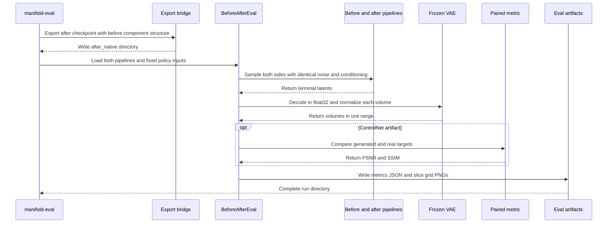

# Before/after GRPO evaluation

## When to use this page

Consult this page when adding or changing the shipped `manifold-eval` entry point, a paired-fidelity scalar, the before/after eval driver, evaluation artifacts, the report builder, or the in-training paired-fidelity monitor (`val/psnr` / `val/ssim`, ADR-0037) that is default-on in the supervised `manifold-train-controlnet` CLI. The offline evaluation workflow composes the [checkpoint-to-native export contract](workflows.md#checkpoint-and-export-contract) and is structurally dependent on the persisted `model_index.json` contract documented in [Architecture and source map](architecture.md#configuration-and-persistence). The in-training monitor is documented here because its offline counterpart is the apples-to-apples baseline it must remain directly comparable with.

The subsystem has three layers:

1. `src/manifold/eval/cli.py` owns the `manifold-eval` console entry and infers the policy from the before native artifact.
2. `src/manifold/eval/before_after.py` owns the policy-agnostic same-noise generation, decode, normalization, scoring, and grid-writing flow.
3. `src/manifold/metrics/paired.py` owns the MONAI-backed 3D PSNR/SSIM metric for paired generations, paired with `src/manifold/metrics/paired_callback.py` (the in-training observe-only monitor) and `src/manifold/training/callbacks/paired_fidelity.py` (its `CallbackRegistry` spec).
4. `src/manifold/eval/comparison_page.py` turns the written metrics and PNGs into a self-contained HTML report. It is library-only, not a console command.

The public `manifold.eval` barrel (`src/manifold/eval/__init__.py`) re-exports `BeforeAfterEval`, `BeforeAfterResult`, `SliceGrid`, `ComparisonPageBuilder`, `JitComparison`, and `ControlNetComparison`. The only shipped console surface is `manifold-eval`, registered in `pyproject.toml` as `manifold-eval = "manifold.eval.cli:main"`. `ComparisonPageBuilder` and `PairedFidelityCallback` are intentionally **not** in `[project.scripts]`: artifact assembly is a local presentation step layered on the written JSON + PNGs, and the in-training monitor is mounted through the supervised CLI's `default_names`, not a console entry.

## Runtime flow


```mermaid
sequenceDiagram
    participant CLI as manifold-eval
    participant Bridge as Export bridge
    participant Core as BeforeAfterEval
    participant Policy as Before and after pipelines
    participant VAE as Frozen VAE
    participant Metric as Paired metric
    participant Files as Eval artifacts

    CLI->>Bridge: Export after checkpoint with before component structure
    Bridge-->>CLI: Write after_native directory
    CLI->>Core: Load both pipelines and fixed policy inputs
    Core->>Policy: Sample both sides with identical noise and conditioning
    Policy-->>Core: Return terminal latents
    Core->>VAE: Decode in float32 and normalize each volume
    VAE-->>Core: Return volumes in unit range
    opt ControlNet artifact
        Core->>Metric: Compare generated and real targets
        Metric-->>Core: Return PSNR and SSIM
    end
    Core->>Files: Write metrics JSON and slice grid PNGs
    Files-->>CLI: Complete run directory
```

*Figure: `manifold-eval` exports the after policy, samples both sides under paired noise, decodes and scores them, and writes portable evaluation artifacts.*

The driver creates a same-noise contract in two ways:

- **JiT / unconditional:** each pipeline receives a fresh generator on the same device with the same `seed`; both produce the same Gaussian start noise.
- **ControlNet / paired:** one noise tensor is drawn for the batch and passed to both `sample_latent` calls. The source latent, real target latent, spacing, contrast labels, and Heun step count stay fixed.

This makes differences attributable to the policy weights rather than random sampling. `BeforeAfterEval` is intentionally injectable: callers can replace its `fidelity` scorer or `grid` renderer, and the CLI can replace real ControlNet data loading with `pairs_provider` in focused smoke tests.

## Policy dispatch and artifact contract

`_pipeline_class_of` reads `pipeline_class` from the before directory's `model_index.json`. There is no evaluation mode flag:

| `pipeline_class` | Resulting path | Evaluation input |
|---|---|---|
| `LatentFlowPipeline` | `run_unconditional` | `--latent-shape`, `--num-samples`, `--modality`, `--spacing`, and fixed seed |
| `ControlNetLatentFlowPipeline` | `run_paired` | held-out `src`/`tgt` latent pairs, spacing, contrast labels, and fixed seed |

The CLI loads a probe pipeline from the before export, uses its UNet/VAE/scheduler structure to run the existing `export_to_native` bridge, and writes the after policy to `<output>/after_native`. The `--before-dir` must be a native directory whose `model_index.json` self-describes (`pipeline_class`); missing the index is a fail-fast `FileNotFoundError`, and an unknown `pipeline_class` raises a `ValueError` listing the supported set. A ControlNet after export reuses the before export's frozen base; only the after checkpoint's trainable `controlnet.*` weights are baked.

The before export remains independent because the export bridge mutates the loaded probe components in place. The ControlNet real-data path also reuses `build_brats_pair_manifest`, `_train_val_manifests`, and the warmed paired latent cache; it applies the before VAE's `scaling_factor` rather than re-estimating it. A held-out validation split is mandatory, either through `--val-data-base-dir` or a positive `--val-fraction`.

## Running the shipped workflow

For JiT, generate unconditional before/after grids:

```bash
manifold-eval \
  --before-dir runs/jit_native \
  --after-ckpt runs/grpo_jit/last.ckpt \
  --output runs/eval_jit \
  --device cuda
```

For ControlNet, evaluate matched translations against held-out real targets:

```bash
manifold-eval \
  --before-dir runs/controlnet_native \
  --after-ckpt runs/grpo_controlnet/last.ckpt \
  --output runs/eval_controlnet \
  --data-base-dir data/brats \
  --val-data-base-dir data/brats_val \
  --latents-dir runs/paired_latents \
  --target-dim 256,256,128 \
  --num-pairs 8 \
  --device cuda
```

Shared controls are `--seed`, `--num-inference-steps`, and `--device`. ControlNet-only controls are `--data-base-dir`, `--val-data-base-dir`, `--val-fraction`, `--latents-dir`, `--cache-tag`, `--target-dim`, `--num-pairs`, `--src-label`, and `--tgt-label`. The console seam also exposes `pairs_provider` for the focused CPU smoke; real launches do not use it.

## Outputs and metric semantics

`BeforeAfterEval` writes one 2.5D PNG per sample. Each grid has three orthogonal center slices (`xy`, `yz`, `zx`) and columns for the policy outputs:

- JiT: `before | after`.
- ControlNet: `before | after | real target`.

`metrics.json` records the policy, seed, inference-step count, sample count, grid basenames, and the before/after values that apply. For ControlNet the generated target and real target are each VAE-decoded and passed through the shared `min_max_to_unit` helper before MONAI scoring. The grid and HTML files use atomic replacement writes, and grid references in JSON are basenames so the report remains portable after the eval directory is moved.

### Paired-fidelity metric

`PairedFidelityMetrics` takes generated and real tensors with equal `[B,C,D,H,W]` shape, already normalized to `[0,1]`. It composes MONAI `PSNRMetric(max_val=1.0)` and `SSIMMetric(spatial_dims=3, data_range=1.0)`, then batch-means both outputs. PSNR is reported in dB and is `+inf` for zero-error/identical volumes; SSIM is bounded by MONAI's metric and equals `1.0` for identical volumes.

`min_max_to_unit` normalizes each decoded volume independently. A constant/degenerate volume maps to zeros instead of dividing by zero. Do not compare unnormalized VAE output, or change the metric's default data range without updating both the ControlNet pipeline and eval paths; that would make in-training and offline measurements diverge. The MONAI 3D SSIM default window also requires spatial extents that fit its configured window, so production smoke fixtures should not shrink every axis below the supported window size.

Unlike unconditional JiT evaluation, paired fidelity is full-reference: it requires a real target. It complements rather than replaces the realism reward, which is deliberately fidelity-blind. As recorded in ADR-0036, offline PSNR/SSIM is the apples-to-apples GRPO comparison; the unconditional JiT continues to use shared `val/fid` plus reward trajectory.

## From metrics to a shareable comparison

`ComparisonPageBuilder.build` accepts `JitComparison(eval_dir, before_csv, after_csv)` and optionally `ControlNetComparison(eval_dir)`. It reads `metrics.json`, optionally reads JiT `val/fid` and `val/mean_reward` series from Lightning `metrics.csv` files, and embeds both generated curves and slice grids as base64 PNG data URIs. The result has no external image, stylesheet, or script dependencies and can be written atomically to an `out_path`.

The page deliberately explains the metric split: JiT is reference-free and uses FID, while ControlNet has a real target and uses PSNR/SSIM. If a ControlNet eval directory is not supplied, the builder emits a clearly marked pending slot rather than inventing a comparison. This API is imported from `manifold.eval`; unlike `manifold-eval`, it is not registered in `[project.scripts]`.

## In-training paired-fidelity monitor (ADR-0037): shipped, observe-only

The supervised `manifold-train-controlnet` CLI mounts an observe-only paired-fidelity monitor on the `CallbackRegistry` by default (`default_names = ["train_loss", "checkpoint", "paired_fidelity"]`). It runs the same Heun ControlNet rollout the offline `manifold-eval` drives, VAE-decodes through the existing `LatentDecoder`, normalizes through `min_max_to_unit`, scores with `PairedFidelityMetrics`, and logs `val/psnr` and `val/ssim` from a fixed paired subset. Because the metric, normalization, and full-rollout generation are identical, the in-training curve and the offline before/after number are directly comparable.

### Wired layers

The seam is complete in the current tree:

| Layer | Source | Notes |
|---|---|---|
| Monitor implementation | `src/manifold/metrics/paired_callback.py` (`PairedFidelityCallback`) | Runs the module's `sample()` under `inference_mode`, stages the VAE through `VaeStage`, decodes through `LatentDecoder`, normalizes with `min_max_to_unit`, and scores with `PairedFidelityMetrics` |
| Registry spec | `src/manifold/training/callbacks/paired_fidelity.py` (`PairedFidelitySpec`) | Knobs: `subset_size`, `every_n_epochs`, `num_inference_steps`, `seed`. `num_inference_steps=None` is **recipe-primary**: it reads from `ctx.inference_recipe["num_inference_steps"]` |
| Registration | `src/manifold/training/callbacks/__init__.py`, `src/manifold/training/controlnet_cli.py` | The supervised CLI registers `PairedFidelitySpec` and threads the recipe through `CallbackContext.inference_recipe={"num_inference_steps": int(num_inference_steps)}` |
| Fixed paired subset | Lazy `_paired_dataset()` resolves `getattr(src, "val_latent_ds", src)` | Honors the F5 cold-path `setup()` replacement of `val_latent_ds`; same subjects are scored each gated epoch (the fixed-sample-validation ethos) |
| Gating | `_gated(trainer)` mirrors `FIDCallback._gated` | All ranks gate identically on `current_epoch` |
| Module-attached metrics | `_PSNR_ATTR` / `_SSIM_ATTR` set on the module in `on_fit_start` | Mirrors how `LatentX0MAE` attaches its metrics so Lightning registers + restores them; `reset()` per gated epoch so the logged value is the current epoch's, not a running mean |

The CLI's `monitor_metric` stays `val/x0_mae` (a `CheckpointSpec` knob). The monitor logs `val/psnr` / `val/ssim` via `PairedFidelitySpec.logged_metrics = frozenset({"val/psnr", "val/ssim"})`, which `CallbackRegistry.validate_monitor` accepts as *validatable* — so an opt-in could watch the fidelity curve without the trainer ever switching selection away from the fast latent surrogate.

### Observe-only contract

The monitor contributes neither loss nor gradient and does not change checkpoint selection:

- Generation runs in `inference_mode` (no grads).
- The two `MeanMetric` instances are attached to the module for Lightning registration; their inputs are reset each gated epoch.
- Generation is `noise = torch.randn(..., generator=...)` seeded freshly each gated epoch — only the policy weights drift between epochs, so the curve reflects quality change rather than sampling stochasticity.
- The subset is the same fixed paired subjects every gated epoch (seeded `randperm` prefix).
- `MonitorMetric` for `CheckpointSpec` stays `val/x0_mae`. Even when a future recipe changes `monitor_metric`, the registered `logged_metrics` set accepts the new monitor through `validate_monitor` and refuses a monitor logged by nobody — keeping the safety net that this monitor never silently switches selection.

### DDP (ADR-0025)

The monitor is mounted on every rank redundantly: identical fixed paired subset + identical seeded noise + DDP-synchronized weights ⇒ identical per-rank results. The cross-rank reduction is Lightning's torchmetrics sync on the `MeanMetric`; there is no sharding and no `all_reduce` beyond the standard sync. `tests/test_paired_fidelity_ddp.py::test_ddp_paired_fidelity_monitor_no_deadlock_and_consistent` exercises the 2-rank ControlNet DDP harness and asserts both ranks log identical finite `val/psnr` / `val/ssim`, the rank-LOCAL (pre-sync) monitor scores match (proving redundant rather than sharded evaluation), the checkpoint monitor stays `val/x0_mae`, and `is_global_zero` writes the monitored `controlnet-*.ckpt`.

### Recipe-primary rollout step count

The controlled CLI fills the previously-`None` `CallbackContext.inference_recipe` with `{"num_inference_steps": int(num_inference_steps)}` from the existing `controlnet.num_inference_steps` recipe knob (issue #239). `PairedFidelitySpec.build` reads it when `num_inference_steps` is not explicitly overridden (`tests/test_callback_registry.py::test_paired_fidelity_spec_reads_num_inference_steps_from_recipe`); an explicit per-callback value overrides the recipe, and a recipe-less context falls back to the callback's own default of 15 Heun steps.

### ControlNet-GRPO extension: deliberate follow-up

Extending the monitor to the ControlNet-GRPO path is a separate change. The blanket `forbidden_callbacks={"fid": ...}` on the ControlNet-GRPO path forbids unconditional FID because it would measure the frozen base's realism, not the ControlNet's translation (a "constant frozen-base metric"). Paired fidelity rolls the trainable ControlNet via `controlnet_rollout`, so that rationale does not cover it — and the separate follow-up releases `forbidden_callbacks` for *this* specific monitor only.

## Change guidance

### Change sampling or add a new policy

Start in `BeforeAfterEval` and preserve the paired-input contract. Policy detection then belongs in `_pipeline_class_of`; add the concrete pipeline to the known mapping and pass real policy-specific inputs through the CLI. Validate both driver-level same-pipeline identity and CLI end-to-end artifact routing.

### Change PSNR, SSIM, or normalization

Change the metric contract in `src/manifold/metrics/paired.py`, re-export names from `src/manifold/metrics/__init__.py`, and update every consumer that must remain comparable. A normalization change crosses `src/manifold/pipelines/pipeline_utils.py`, `src/manifold/pipelines/controlnet_latent_flow.py`, `src/manifold/eval/before_after.py`, and `src/manifold/metrics/paired_callback.py`; it is not an eval-only change because the in-training monitor must stay numerically locked to the offline eval.

### Add or change report content

Treat `BeforeAfterResult.metrics` and the persisted JSON/PNG layout as the source contract. Update `ComparisonPageBuilder`, both comparison test fixtures, and the in-tree builder tests. Keep `ComparisonPageBuilder` library-only unless a separate decision introduces a new console command; artifact assembly is intentionally outside `manifold-eval` runtime.

### Add a console entry

Register the callable in `pyproject.toml` and ensure the executable is exercised from a real subprocess or equivalent installed-command smoke, not only an in-process import. For `manifold-eval`, retain `main(argv=None)` as the consumer seam and keep the before-artifact policy inference free of a mode flag.

### Extend or revoke the in-training monitor

Adding a new metric to the callback set, switching checkpoint selection onto `val/psnr` / `val/ssim`, or extending the monitor to the ControlNet-GRPO path is a `forbidden_callbacks` / `forbidden_monitors` discussion: the GRPO path's current blanket ban on `fid` does not cover paired fidelity because the latter uses the trainable ControlNet, and releasing that ban only for `paired_fidelity` requires touching `controlnet_cli.py` (registration) and the GRPO shell. Any change to `monitor_metric` for the supervised stage is a recipe-level change that `tests/test_callback_registry.py::test_paired_fidelity_spec_keeps_checkpoint_monitor_on_x0_mae` will detect.

## Focused tests and minimal validation

| Behavior | Existing test anchor |
|---|---|
| Metric identity, known PSNR (the `10·log10(max_val²/MSE)` reference formula), perturbation monotonicity, 3D input, and shape rejection | `tests/test_paired_fidelity.py` |
| Callback hook: gate, fixed subset, determinism, observe-only, [0,1] volumes, PSNR `+inf` ceiling, shape-mismatch surfacing, and registered `logged_metrics` | `tests/test_paired_fidelity_callback.py` |
| 2-rank DDP: no hang, identical `val/psnr` / `val/ssim` (rank-local pre-sync + synced logged values), checkpoint stays on `val/x0_mae`, `is_global_zero` still writes the monitored ckpt | `tests/test_paired_fidelity_ddp.py` |
| JiT and ControlNet same-seed/same-pipeline identity, normalization, paired columns, scores, and reproducible grids | `tests/test_before_after_eval.py` |
| Console policy routing, after-export weight bake, held-out data loading, and required inputs | `tests/test_eval_cli.py` |
| Self-contained HTML, metric explanation, curves, grids, pending slot, and output file | `tests/test_comparison_page.py` |
| Registry: spec resolves + builds, rejects unknown knobs, declares `logged_metrics`, leaves `monitor_metric` on `val/x0_mae`, and reads `num_inference_steps` from `inference_recipe` | `tests/test_callback_registry.py` (the `PairedFidelitySpec` block) |
| Supervised ControlNet shell's `default_names` includes `paired_fidelity` and the CLI exercises `run_controlnet_training` with the monitor attached | `tests/test_controlnet_cli.py` |

Run the full focused evaluation surface with:

```bash
pytest tests/test_paired_fidelity.py tests/test_paired_fidelity_callback.py tests/test_paired_fidelity_ddp.py tests/test_before_after_eval.py tests/test_eval_cli.py tests/test_comparison_page.py tests/test_callback_registry.py -q
```

For a fast first pass, run `pytest tests/test_paired_fidelity.py tests/test_paired_fidelity_callback.py tests/test_before_after_eval.py -q`; the CLI, registry, report-builder, and DDP tests are still required when crossing the installed console, registry-driven monitor wiring, artifact/presentation, or multi-rank boundary. Also consult [Operations and testing](operations-and-testing.md#standard-checks) for the repository test matrix and the conditions that make broader DDP or packaging checks necessary.
