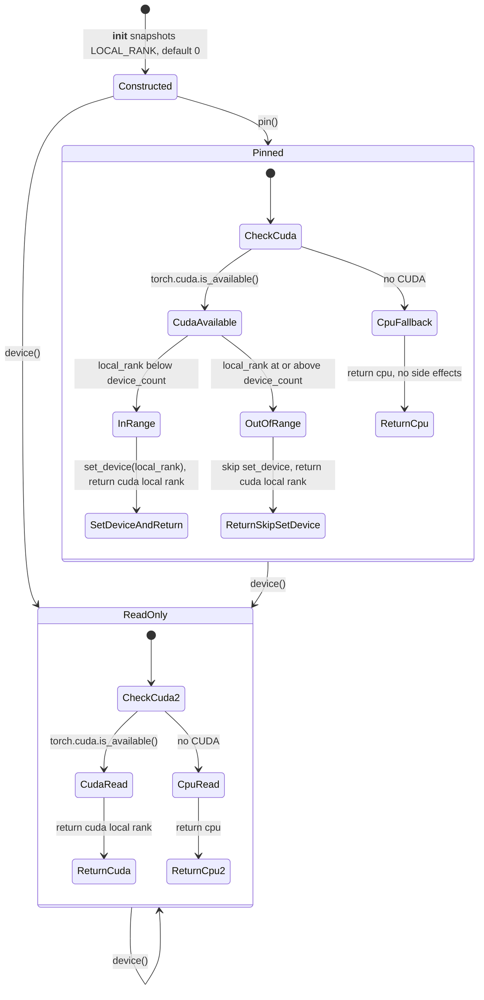

# Frozen arms and per-rank device policy

Two mechanisms own the cross-cutting "what is frozen / which GPU does it land on"
concern that every training CLI has to get right:

- **`FrozenArmMixin`** (`src/manifold/modules/frozen_arm.py`, ADR-0031 A1) — the
  shared "register + dual-exclude" implementation that keeps a frozen arm off
  the optimizer and off the checkpoint while letting Lightning own its device
  placement through the standard submodule machinery. Used by `GRPOModule`
  (frozen `unet` arm on the ControlNet policy path; frozen `reward_model` and
  frozen reference policy on the GRPO reward path), by
  `ControlNetLatentFlowModule` (frozen `unet` arm), and by `RewardModule`
  (frozen `reference_unet`).
- **`DevicePolicy`** (`src/manifold/training/device_policy.py`, ADR-0035) — the
  per-rank CUDA device decision. Replaces both the duplicated pre-PG
  `set_device` twin that lived in every training `main()` and the
  `manifold.data.latent_pipeline.resolve_warm_device` free function used by the
  post-PG VAE warm. Three methods: `pin` (one `set_device` side effect pre-PG),
  `device` (side-effect-free read), `warm_device` (post-PG per-rank CUDA
  resolution, byte-identical to the former free function).

The two are paired concerns (one decides what is frozen, the other decides where
the GPU lands) and share an ADR-0035 test pattern: source-level guards via
`inspect.getsource` keep the retired free function / twin / mixin bypass from
sneaking back in.

## FrozenArmMixin: register + dual-exclude

### Why this exists (ADR-0031 A1)

The previous scheme kept a frozen base UNet *unregistered* on the host via
`object.__setattr__`, hiding it from the module tree entirely. That worked for
the off-optimizer and off-checkpoint invariants but broke Lightning's automatic
`.to(device)`, forcing a manual staging step in `on_fit_start` and leaving
Mode-1 (supervised) and Mode-2 (GRPO ControlNet) forks out of sync. ADR-0031
chose the opposite direction: **register** the frozen arm as a normal
`nn.Module` submodule so Lightning owns its device placement, and **dual-exclude**
it from the optimizer and the checkpoint through targeted overrides.

### The mixin contract

```python
class XModule(FrozenArmMixin, spt.Module):
    def __init__(self):
        super().__init__()
        self._register_frozen_arm("frozen_name", arm)
        self.trainable = ...
```

Declare the host as `class XModule(FrozenArmMixin, spt.Module)` so the mixin
precedes `spt.Module`. The three dunder overrides chain to `nn.Module` via
cooperative `super()` because neither `spt.Module` nor
`pl.LightningModule` overrides `state_dict` / `load_state_dict` / `train`
(verified in `tests/test_frozen_arm_mixin.py`). The production MRO is exercised
by the three host modules' existing tests; the mixin's own tests use a minimal
`nn.Module`-based `_Host` to exercise the cooperative-`super()` contract
without dragging in Lightning's forward/optim machinery.

`_register_frozen_arm(name, arm)` does the uniform prep **once at construction**:

- `arm.eval()`
- `arm.parameters()` → `requires_grad_(False)`
- `setattr(self, name, arm)` (registers as a normal submodule)
- `self._frozen_arm_names |= {name}` (the arm set is fixed at init)

That single call is the only place the "register + dual-exclude" prep is
applied — adding a frozen arm cannot forget the freeze.

### The three dunder overrides

- **`state_dict(destination, prefix='', keep_vars=False, ...)`** — strips the
  registered frozen arms **in place on the shared `destination`** (matching the
  arms under the caller-supplied `prefix`). The filter must mutate, not build a
  fresh dict, because a parent/wrapper that drives the recursion reads the
  `destination` it passed in (DDP's `module.state_dict(destination=..., prefix='')`
  discards the child's return value). Prefix-awareness is what stops a
  `module.frozen.*` key from leaking under the DDP wrapper prefix.
- **`load_state_dict(state_dict, strict=True, ...)`** — strict on the
  **trainable** keys, lenient only on the frozen arms. The checkpoint never
  carries frozen-arm weights (state_dict strips them); the arms are rebuilt
  fresh each launch (the reward from its own `.ckpt`, the reference policy via
  `deepcopy`, the ControlNet-policy base from the native export). The frozen
  arms being absent from the checkpoint is the one tolerated mismatch. A
  missing or unexpected **trainable** key still raises with the standard
  `RuntimeError("missing")` / `RuntimeError("unexpected")` (no blanket
  `strict=False`, which would resume on stale or random weights).
- **`train(mode=True)`** — re-applies `eval()` on every registered frozen arm
  after `super().train(mode)`. Registration makes Lightning's recursive
  `train(True)` flip the arms to training mode; the override re-freezes them so
  BatchNorm running stats cannot drift during rollout / reward evaluation.

The mixin **does not own optimizer arm-selection**: "which arm is optimized"
stays in each host's `configure_optimizers` (GRPO → unet/controlnet, reward →
`reward_model`, ControlNet → `controlnet`). The mixin guarantees only the
`requires_grad=False` layer; the host's optimizer simply never selects the
frozen arms. `configure_optimizers` excludes frozen arms by construction (see
the host tests: `tests/test_grpo.py`, `tests/test_controlnet_module_training.py`,
`tests/test_reward.py`).

### MRO detail

Because the production host is `FrozenArmMixin, spt.Module` and the dunders
chain through `nn.Module`, the `_Host` test fixture uses the same ordering with
`nn.Module` as the base. This keeps the mixin's behavioral contract tests
independent of Lightning's forward / configure_optimizers machinery while
remaining a faithful exercise of the cooperative-`super()` chain.

### Acceptance matrix (FrozenArmMixin)

The mixin's behavior contract is locked down by `tests/test_frozen_arm_mixin.py`:

| Behavior | Test |
|---|---|
| Registration applies the uniform frozen-arm prep (eval + requires_grad=False) and adds to `_frozen_arm_names` | `test_register_frozen_arm_freezes_and_evals` |
| `state_dict()` strips the frozen arm in place on the shared `destination` | `test_state_dict_strips_frozen_arm_in_place` |
| `state_dict()` strips the frozen arm through the DDP wrapper prefix | `test_state_dict_strips_frozen_arm_through_wrapper_prefix` |
| `load_state_dict` strict on trainable, lenient on the frozen arm | `test_load_state_dict_strict_except_frozen_allowlist` |
| `module.train()` keeps the frozen arm in eval | `test_train_keeps_frozen_arm_in_eval` |
| Backward reaches the trainable arm; the frozen arm carries no grad | `test_backward_only_touches_trainable_arm` |
| The host's `configure_optimizers` wires the trainable arm only | `test_configure_optimizers_excludes_frozen_arm` |

The host-level proof that "the base is registered but dual-excluded" lives at
`tests/test_controlnet_module_training.py::test_base_is_registered_but_dual_excluded`
(ADR-0031 A1 acceptance): the base is present in `parameters()` (so Lightning
owns device placement) but `requires_grad=False`, absent from the optimizer
groups, and absent from `state_dict()`. The `ControlNetLatentFlowModule` host
test exercises the same contract on the production `spt.Module` MRO.

## DevicePolicy — the per-rank CUDA decision

### Why this exists (ADR-0035)

Three pre-existing call sites all duplicated the same answer to "which GPU does
this rank use":

1. The pre-PG `set_device` twin, character-identical across `grpo_cli.main`
   and `reward_cli.main` (issue #205, ADR-0035 T2).
2. The controlnet CLI's pre-PG `torch.device("cuda" if torch.cuda.is_available() else "cpu")`
   that resolved to `cuda:0` for every DDP rank — the source of the PR #156
   `cuda:0` race / DDP-init-timeout category ADR-0031 §A2 promised to close
   (issue #206, ADR-0035 T3).
3. The `manifold.data.latent_pipeline.resolve_warm_device` free function used
   by the JiT `_warm_data` and the controlnet `_real_inputs` VAE warm closures
   (issues #207 / #208, ADR-0035 T4 / T5).

ADR-0035 collapses all three into a single `DevicePolicy` class with three
methods. The behavior is byte-identical to the prior code paths; the change is
de-duplication.

### Construction

```python
policy = DevicePolicy()  # side-effect free: snapshots LOCAL_RANK (missing -> 0)
```

`__init__` only reads `os.environ.get("LOCAL_RANK", "0")` and stores the
result. It touches neither CUDA nor the process group. The snapshot is taken
**once at construction** — post-PG callers do **not** re-resolve via
`dist.get_rank()`. A `torchrun` launch always sets `LOCAL_RANK`; a single-process
launch does not, and the default 0 is correct in that case.

### `pin` — the one-time pre-PG side effect

```python
device = policy.pin()
```

This is the call every training CLI `main()` makes **before** Lightning
initializes the process group:

- If `torch.cuda.is_available()`:
  - if `local_rank < torch.cuda.device_count()` → `torch.cuda.set_device(local_rank)` (the one side effect), then return `torch.device(f"cuda:{local_rank}")`.
  - else (out-of-range, the "twin guard") → **skip** `set_device`, return `cuda:{local_rank}`.
- Else → return `torch.device("cpu")`, no side effects.

The out-of-range guard mirrors the prior twin: if `LOCAL_RANK` exceeds the
device count (e.g. a misconfigured `CUDA_VISIBLE_DEVICES`), the rank still
gets the per-rank device value but does not call `set_device` (which would
raise). This is the "twice-bitten" guard: never silently fall back, never
raise on a misconfigured but recoverable launch.


*Figure: `DevicePolicy` state transitions — `pin()` performs the one-time pre-PG `set_device` (with the twin's out-of-range guard), `device()` is the side-effect-free read.*

### `device` — side-effect-free read

```python
device = policy.device()
```

Returns the same `cuda:{local_rank}` (or `cpu`) without calling `set_device`.
Use this for read-only / debug paths where the caller does not want the side
effect (most code does want `pin`).

### `warm_device` — post-PG VAE warm resolution

```python
device = policy.warm_device(launch_time_fallback)
```

This replaces `manifold.data.latent_pipeline.resolve_warm_device` (now
deleted). The semantics are byte-identical:

- `import torch.distributed as dist` happens **inside the method body**, so
  importing the module never touches the process group
  (`test_warm_device_dist_import_is_lazy` guards the contract).
- If `fallback.type == "cuda"` and `dist.is_initialized()` → return
  `cuda:{local_rank}` (the per-rank device from the construction-time
  snapshot, not a `dist.get_rank()` re-resolution).
- Otherwise → return the `fallback` unchanged (CPU fallback stays CPU;
  single-process fallback stays whatever the launch-time capture was).

There is **no `is_available()` check**: the gate is "CUDA fallback under a
live PG", so a CUDA fallback under a live PG resolves to `cuda:{local_rank}`
even when CUDA is unavailable on the box. This matches the former
`resolve_warm_device` semantics — verified by
`test_warm_device_pg_up_without_cuda_still_resolves_cuda_fallback`.

The launch-time `fallback` is captured in the shell's `main()` **before** the
PG is initialized, so under DDP it is the default `cuda:0` (the rank's
`CUDA_VISIBLE_DEVICES`-exposed index 0). After the PG is up (inside
`DataModule.setup()`), `LOCAL_RANK` names the rank's actual GPU and
`warm_device` returns it.

### Acceptance matrix (DevicePolicy)

The behavior contract is locked down by `tests/test_device_policy.py`:

| Behavior | Test |
|---|---|
| `pin()` under LOCAL_RANK=k + CUDA available returns `cuda:k` and calls `set_device(k)` exactly once | `test_pin_returns_cuda_local_rank_and_sets_device_exactly_once` |
| Out-of-range LOCAL_RANK → no `set_device`, still returns `cuda:k` | `test_pin_out_of_range_local_rank_skips_set_device` |
| No CUDA → `cpu`, zero side effects | `test_pin_cpu_unavailable_returns_cpu_no_side_effects` |
| LOCAL_RANK unset → defaults to 0 | `test_pin_local_rank_unset_defaults_to_zero` |
| `device()` returns the same value as `pin()` but never calls `set_device` | `test_device_returns_cuda_local_rank_side_effect_free` |
| `warm_device` under live PG + CUDA fallback → `cuda:3` | `test_warm_device_local_rank_under_ddp` |
| `warm_device` non-CUDA fallback returned unchanged under DDP | `test_warm_device_non_cuda_fallback_returned_unchanged` |
| `warm_device` single-process fallback returned unchanged | `test_warm_device_single_process_fallback_returned_unchanged` |
| `warm_device` PG-up + CUDA-fallback + no CUDA still resolves (no `is_available` gate) | `test_warm_device_pg_up_without_cuda_still_resolves_cuda_fallback` |
| `import torch.distributed` is lazy (inside the method body, not at module level) | `test_warm_device_dist_import_is_lazy` |

The source-level guards at the end of the file (`test_grpo_cli_main_pins_via_device_policy_not_inline_set_device`,
`test_reward_cli_main_pins_via_device_policy_not_inline_set_device`,
`test_controlnet_cli_main_pins_via_device_policy_not_bare_cuda`,
`test_p1_warm_fn_uses_local_rank_device_not_launch_device`,
`test_p1_controlnet_warm_uses_device_policy_not_resolve_warm_device`)
keep the prior call patterns from sneaking back in.

## Source map

- Mixin implementation: `src/manifold/modules/frozen_arm.py`
- Mixin barrel export: `src/manifold/modules/__init__.py` (re-exports
  `FrozenArmMixin`)
- Hosts that consume the mixin: `src/manifold/modules/grpo.py`,
  `src/manifold/modules/controlnet_latent_flow.py`, `src/manifold/modules/reward.py`
- Device policy implementation: `src/manifold/training/device_policy.py`
- CLI shells that call `pin()`: `src/manifold/training/grpo_cli.py`,
  `src/manifold/training/reward_cli.py`, `src/manifold/training/controlnet_cli.py`,
  `src/manifold/training/cli.py` (JiT)
- VAE-warm closures that call `warm_device()`:
  `src/manifold/training/cli.py::_warm_data`,
  `src/manifold/training/controlnet_cli.py::_real_inputs`

## Focused tests

```bash
pytest tests/test_frozen_arm_mixin.py tests/test_device_policy.py -q
```

For a host wiring change (adding a frozen arm to a new module, switching a
host to `FrozenArmMixin`), also run the host's own tests:

- GRPO hosts: `pytest tests/test_grpo.py -q`
- ControlNet hosts: `pytest tests/test_controlnet_module_training.py -q`
- Reward hosts: `pytest tests/test_reward.py -q`

For a CLI shell change to the `pin()` / `warm_device()` wiring, also run:

- `pytest tests/test_ddp_warm.py tests/test_training_cli.py tests/test_controlnet_cli.py -q`

The `inspect.getsource`-style guards in `tests/test_device_policy.py` are the
load-bearing acceptance: any regression that re-introduces the inline
`set_device` twin, the bare `torch.device("cuda")` in the controlnet CLI, or
the `resolve_warm_device` free function will fail those tests loudly.
